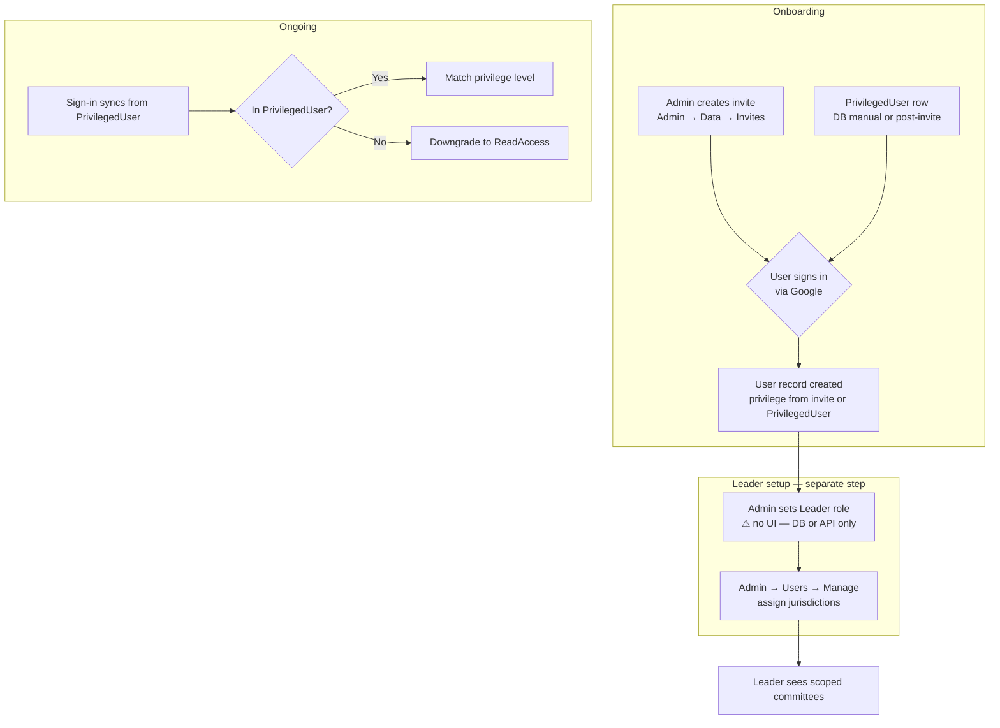

# Admin User Management — Current State Review & Recommendations

**Date:** 2026-06-20  
**Context:** Investigation of `/admin/users` after observing that the **Manage** button for Admin/Developer users (including `system@internal` and the signed-in admin) toggles to **Hide** without revealing any panel.  
**Goal:** Document how user management works today, identify gaps, and recommend a unified **Admin → Users** experience where anything allowed in the system is accessible in one place.

---

## Executive Summary

User lifecycle management is **fragmented** across three surfaces today:

| Surface | Location | Purpose |
| ------- | -------- | ------- |
| **Users page** | `/admin/users` | Jurisdiction assignment for **Leaders only** |
| **Invites tab** | `/admin` → Data → Invites | Create/delete signup invites; set initial role |
| **Database / auth hooks** | `PrivilegedUser` table, `auth.ts` | Pre-authorize emails; sync privilege on sign-in |

The `/admin/users` page lists Leader, Admin, and Developer accounts but only **Leaders** have actionable **Manage** content. Admin and Developer rows show a misleading **Manage** button that does nothing visible — a UX bug, not intended behavior.

**Recommendation:** Evolve `/admin/users` into a **single User Management hub** with three sections (or tabs): **All Users**, **Pending Invites**, and **Jurisdiction Scope** (Leaders). Consolidate invite management from Admin → Data, add role management for existing users, fix the Manage-button confusion, and add Leader to the invite role picker.

---

## 1. Current State — `/admin/users`

### 1.1 Page access

- **Route:** `/admin/users`
- **Nav:** Enabled in `adminSidebarConfig` (`apps/frontend/src/config/adminNav.ts`)
- **Gate:** `AuthCheck` at `PrivilegeLevel.Admin` in `page.tsx` and `admin/layout.tsx`
- **Who can access:** **Admin** and **Developer** (Developer ranks above Admin in `hasPermissionFor`)
- **Who cannot access:** Leader, RequestAccess, ReadAccess

### 1.2 Who appears in the table

The server query in `page.tsx` loads users where `privilegeLevel` is one of:

- `Leader`
- `Admin`
- `Developer`

**Not listed:** `ReadAccess`, `RequestAccess`, or any other lower-privilege users — even though they are valid accounts in the system.

Special case: **`system@internal`** (`id: "system"`) is seeded as a **Developer** user for audit-trail FK integrity. It never authenticates but appears in the table.

### 1.3 Table columns

| Column | Leader | Admin / Developer |
| ------ | ------ | ----------------- |
| Name | ✓ | ✓ |
| Email | ✓ | ✓ |
| Role | ✓ | ✓ |
| Jurisdictions | Count | `—` |
| Actions | Manage / Hide | Manage / Hide |

### 1.4 Manage button behavior

The **Manage** button is rendered for **every row** in the table. Clicking it sets `expandedUserId` and toggles the label to **Hide**.

The expanded jurisdiction panel only renders when **both** conditions are true:

```tsx
{isExpanded && isLeader && ( /* jurisdiction card */ )}
```

(Source: `apps/frontend/src/app/admin/users/UsersClient.tsx`)

**Result:**

| User type | Click Manage | Visible outcome |
| --------- | ------------ | --------------- |
| **Leader** | Expands row | Jurisdiction list, Add/Remove controls |
| **Admin** | Button → Hide | **Nothing else appears** |
| **Developer** | Button → Hide | **Nothing else appears** |

This matches the observed behavior for `system@internal` and the signed-in admin.

### 1.5 Prerequisite: active term

If no active committee term is configured, the page shows a message and does not render the user table at all. Jurisdiction assignments are scoped to a term (`UserJurisdiction.termId`).

### 1.6 What Manage does for Leaders (working as designed)

For Leader rows, **Manage** opens a card with:

- Current jurisdictions for the **active term** (city/town, optional leg district, assigned date)
- **Remove** per row (with confirmation dialog)
- **Add jurisdiction** form: city/town combobox (from active-term committee lists), optional leg district, duplicate prevention

Backed by:

- `POST /api/admin/jurisdictions` — assign (Leader only; audits `JURISDICTION_ASSIGNED`)
- `DELETE /api/admin/jurisdictions/[id]` — remove
- `GET /api/admin/jurisdictions?userId=&termId=` — list

Jurisdictions are **Leader-only by design**. `getUserJurisdictions()` returns `null` for Admin/Developer (no scope restriction). The API rejects non-Leaders:

> "User must have Leader privilege to receive jurisdiction assignments"

(SRS 3.1 — [3.1-jurisdiction-assignment-ui.md](./SRS/tickets/3.1-jurisdiction-assignment-ui.md))

---

## 2. User Management Elsewhere in the System

### 2.1 Invite management (Admin → Data → Invites)

**UI:** `InviteManagement.tsx` under the **Invites** tab in `AdminDataClient.tsx` (`/admin` root).

**API:** `/api/admin/invites` (GET, POST, DELETE) — Admin+ only.

**Capabilities:**

- Create invite with email, privilege level, optional message, expiry (1–365 days)
- List pending and used invites
- Copy invite URL, delete unused invites

**Invite role picker (UI):** ReadAccess, RequestAccess, Admin  
**Invite role picker (API):** Any `PrivilegeLevel` **except Developer**

**Gap:** **Leader is not offered in the invite UI**, even though the API accepts it and the post-signup workflow (assign jurisdictions on `/admin/users`) assumes Leaders exist.

**Flow on signup** (`auth.ts`):

1. New user must have a valid invite or be in `PrivilegedUser`
2. On `createUser`, invite is marked used; `User.privilegeLevel` set from invite
3. User is added to `PrivilegedUser` (persists role across sign-ins)

### 2.2 PrivilegedUser table (database-only)

**Model:** `PrivilegedUser { email, privilegeLevel }` in `schema.prisma`

**Purpose:**

- Pre-authorize sign-in for emails not yet in `User`
- Source of truth for privilege sync on every sign-in

**Sign-in sync behavior** (`auth.ts`):

- If email is in `PrivilegedUser` → update `User.privilegeLevel` to match
- If email is **not** in `PrivilegedUser` and current level ≠ ReadAccess → **downgrade to ReadAccess**

There is **no admin UI** to add, edit, or remove `PrivilegedUser` rows. Changes require direct database access.

### 2.3 Developer-only tooling (not user management)

| Feature | Location | Notes |
| ------- | -------- | ----- |
| **Acting privilege level** | Profile sheet (`manageProfile.tsx`) | Developer can view the app as another role in the UI only; not persisted |
| **loadAdmin API** | `POST /api/admin/loadAdmin` | Developer-only; promotes hardcoded emails to Developer |

These are developer conveniences, not admin user management.

### 2.4 Audit trail user filter

`GET /api/admin/audit/users` returns distinct users who appear in audit logs — used only for the Audit Trail filter dropdown, not general user management.

### 2.5 Privilege hierarchy (reference)

From `apps/frontend/src/lib/utils.ts`:

```
Developer > Admin > Leader > RequestAccess > ReadAccess
```

`hasPermissionFor(user, required)` grants access when the user's level is **equal or higher** (lower index in the ordered array).

---

## 3. End-to-End User Lifecycle Today



**Pain points in this flow:**

1. Creating a Leader requires a workaround (DB/API); invite UI doesn't offer Leader
2. Jurisdiction assignment lives on a different page from invites
3. Changing an existing user's role has no UI
4. Lower-privilege users are invisible on the Users page
5. Manage button implies action for users who have no manageable settings

---

## 4. Gaps & UX Issues

### 4.1 Confusing Manage button (bug / UX debt)

- **Issue:** Manage shown for Admin/Developer; only toggles to Hide
- **Severity:** High — erodes trust in the admin UI
- **Fix (minimal):** Show Manage only for Leaders, or show inline text: *"Jurisdictions apply to Leaders only"*

### 4.2 Fragmented admin experience

- Invites under **Data**; jurisdictions under **Users**
- IA-01 noted this explicitly: *"Invite management stays under Data unless 3.1 adds `/admin/users` — then consider whether invites move there"* ([IA-01-implementation-action-items.md](./SRS/IA-01-implementation-action-items.md))

### 4.3 Incomplete role coverage in invites

- Leader role missing from invite dropdown despite API support and jurisdiction workflow

### 4.4 No post-creation role management

- No API or UI to promote/demote existing users
- `PrivilegedUser` is the persistence mechanism but is DB-only
- Removing someone from admin access requires DB edits; sign-in hook will downgrade only if `PrivilegedUser` row is deleted

### 4.5 Incomplete user directory

- Users page shows Leader+ only
- No single view of all accounts (ReadAccess, RequestAccess, pending invites)

### 4.6 system@internal in the roster

- Seeded Developer account for audit FK integrity
- Clutters the admin user list; should be hidden or clearly marked as non-interactive system account

### 4.7 No deactivation / access revocation UI

- No "disable user" or "revoke access" action
- Closest mechanism: delete `PrivilegedUser` row (downgrade on next sign-in) — manual only

---

## 5. Recommendation — Unified User Management Hub

### 5.1 Design principle

> **Anything that should be allowed in the system should be accessible from Admin → Users.**

An admin should not need to know about `PrivilegedUser`, separate Data tabs, or database tables to onboard a Leader, change a role, or revoke access.

### 5.2 Proposed information architecture

Restructure `/admin/users` as the **single entry point** for all user lifecycle operations. Remove (or redirect) the Invites tab from Admin → Data.

```
/admin/users
├── [Tab] All Users          — searchable directory of every account
├── [Tab] Pending Invites    — moved from Admin → Data
└── [Tab or inline] Scope    — jurisdiction management (Leaders only)
```

Alternative (single-page): one table with filters (`All | Leaders | Admins | Pending invites`) and contextual row actions — tabs are clearer for v1.

### 5.3 All Users tab

**List:** Every `User` record (optionally exclude or dim `system@internal`).

| Column | Notes |
| ------ | ----- |
| Name, Email | |
| Role | Badge with color by level |
| Status | Active / Pending invite / System account |
| Jurisdictions | Count for Leaders; "Full access" for Admin/Developer; "—" for others |
| Last sign-in | If available (may require schema addition) |
| Actions | Context menu per row |

**Row actions by role:**

| Role | Actions |
| ---- | ------- |
| **ReadAccess / RequestAccess** | Change role, Send invite (if not yet signed up), Revoke access |
| **Leader** | Change role, Manage jurisdictions (expand or navigate) |
| **Admin** | Change role (with confirmation; cannot demote self?) |
| **Developer** | View only or Developer-only promote (no demote via UI) |
| **system@internal** | No actions; show "System account" label |

### 5.4 Pending Invites tab

Move existing `InviteManagement` component here (or reimplement with shared styling).

**Enhancements:**

- Add **Leader** to privilege level dropdown (align UI with API)
- Show link: *"After signup, assign jurisdictions on the Leaders section"*
- Optional: filter invites by role, show expired/used in collapsible section

### 5.5 Jurisdiction management (Leaders)

Keep current expand-row UX for Leaders, with these fixes:

- **Manage** button only on Leader rows (or rename to **Manage scope**)
- Non-Leader rows: no Manage button, or disabled with tooltip
- Optional: dedicated **Leaders** filter on All Users tab that defaults to showing jurisdiction panel

Term selector (future): if multiple terms matter for assignment, add term picker; v1 can keep active-term-only with a note.

### 5.6 Role change flow (new capability)

**New API:** e.g. `PATCH /api/admin/users/[id]` with body `{ privilegeLevel }`

**Rules:**

- Admin can assign: ReadAccess, RequestAccess, Leader, Admin
- Admin **cannot** assign Developer (reserve for seed / Developer tooling)
- Admin **cannot** demote the last Admin (guardrail)
- Admin **cannot** change their own role (or require second admin confirmation)
- Updating role must upsert/delete `PrivilegedUser` to stay consistent with sign-in sync
- Audit log: new action e.g. `USER_PRIVILEGE_CHANGED`

**UI:** Role dropdown or modal on user row with confirmation explaining impact (e.g. "Leader → ReadAccess will remove committee write access and jurisdictions will remain in DB but be inactive").

### 5.7 Access revocation (new capability)

**Option A (soft):** Remove from `PrivilegedUser` + set `User.privilegeLevel` to ReadAccess immediately. User can still sign in with read-only access.

**Option B (hard):** Add `User.disabledAt` or block sign-in for specific emails. Stronger but needs schema + auth callback change.

**Recommendation for v1:** Option A — matches existing sign-in downgrade logic; expose as **Revoke elevated access** in UI.

### 5.8 system@internal handling

- Filter out of default list, **or**
- Show in a collapsed "System accounts" section with explanation (audit trail actor)

Do not show Manage on this row.

---

## 6. Proposed User Flows (Target State)

### 6.1 Onboard a new Leader

1. Admin → Users → **Pending Invites** → Create invite, role **Leader**
2. User signs in via invite link
3. Admin → Users → **All Users** → find user → **Manage scope** → add city/LD jurisdictions
4. Leader sees scoped committees (or empty state with assigned jurisdictions listed)

Single page, clear sequence, no DB edits.

### 6.2 Promote existing user to Admin

1. Admin → Users → **All Users** → find user → **Change role** → Admin → Confirm
2. `PrivilegedUser` updated; audit logged
3. User gets admin sidebar on next page load (session may need refresh)

### 6.3 Revoke admin access

1. Admin → Users → find user → **Revoke elevated access** → Confirm
2. User demoted to ReadAccess; removed from `PrivilegedUser`
3. On next sign-in, sync confirms ReadAccess

### 6.4 What Admin/Developer rows show

No Manage button. Role column shows **Admin** or **Developer** with helper text: *"Full system access — no jurisdiction scope required."*

---

## 7. Implementation Phases

### Phase 0 — Quick fixes (0.5 day)

No new APIs. Immediate clarity.

- [ ] Hide or disable **Manage** for non-Leader rows
- [ ] Add tooltip or subtitle on page: *"Manage jurisdictions for Leader accounts"*
- [ ] Hide or label `system@internal` in the table
- [ ] Add **Leader** to invite dropdown in `InviteManagement.tsx`

### Phase 1 — Consolidate surfaces (1–2 days)

- [ ] Move Invites tab content to `/admin/users` (Pending Invites tab)
- [ ] Remove Invites tab from Admin → Data (or leave redirect/link for one release)
- [ ] Shared page header: "User Management" with short description of tabs

### Phase 2 — Full user directory (2–3 days)

- [ ] Expand server query to include all users (with sensible default sort/filter)
- [ ] Search/filter by name, email, role
- [ ] Status column: active vs pending invite (join or separate query)
- [ ] Row actions stub for non-Leaders (disabled until Phase 3)

### Phase 3 — Role management API + UI (2–3 days)

- [ ] `PATCH /api/admin/users/[id]` with validation rules above
- [ ] Sync `PrivilegedUser` on change
- [ ] Audit logging
- [ ] Role change UI with confirmations
- [ ] Tests mirroring jurisdiction route patterns

### Phase 4 — Access revocation (1 day)

- [ ] Revoke action wired to demote + remove `PrivilegedUser`
- [ ] Confirmation copy explaining effect
- [ ] Audit log

### Phase 5 — Polish (optional)

- [ ] Last sign-in timestamp (schema migration if needed)
- [ ] Bulk invite import
- [ ] Term selector for jurisdiction assignment when multi-term admin is needed

---

## 8. What Stays Outside Users

| Concern | Keep where | Rationale |
| ------- | ---------- | --------- |
| Voter data import | Admin → Data | Data ops, not identity |
| Committee discrepancies | Admin → Data | Data quality |
| Developer acting-as | Profile sheet | Dev tooling, not admin function |
| Audit trail | Admin → Audit | Read-only history; link from user row optional |

---

## 9. Success Criteria

An admin with no codebase knowledge can:

1. **See every account** and its role in one place
2. **Invite a new user** with the correct role (including Leader)
3. **Assign jurisdictions** to Leaders without confusion about Admin/Developer rows
4. **Change or revoke roles** without database access
5. **Understand why** some users have no jurisdiction column (full access vs scoped)

---

## 10. Key File & API Reference

| Item | Path |
| ---- | ---- |
| Users page (server) | `apps/frontend/src/app/admin/users/page.tsx` |
| Users client | `apps/frontend/src/app/admin/users/UsersClient.tsx` |
| Invite UI | `apps/frontend/src/app/admin/data/InviteManagement.tsx` |
| Invite API | `apps/frontend/src/app/api/admin/invites/route.ts` |
| Jurisdiction API | `apps/frontend/src/app/api/admin/jurisdictions/route.ts` |
| Auth / privilege sync | `apps/frontend/src/auth.ts` |
| Privilege helper | `apps/frontend/src/lib/utils.ts` (`hasPermissionFor`) |
| Admin nav config | `apps/frontend/src/config/adminNav.ts` |
| SRS 3.1 ticket | `docs/SRS/tickets/3.1-jurisdiction-assignment-ui.md` |
| IA-01 action items | `docs/SRS/IA-01-implementation-action-items.md` |
| System user seed | `apps/frontend/prisma/seed.ts` (`system@internal`) |

---

## 11. Summary

The **Manage** button on `/admin/users` is misleading for Admin and Developer accounts because jurisdiction management is intentionally **Leader-only**, but the UI renders the button for every row in the Leader+ query. User management capabilities are split between the Users page (jurisdictions), the Data → Invites tab (onboarding), and the database (`PrivilegedUser`), with no UI for post-creation role changes.

The recommended path is a **unified User Management hub** at `/admin/users` covering directory, invites, role changes, and Leader scope — with quick fixes first (hide irrelevant Manage buttons, add Leader to invites), then consolidation and new APIs for role lifecycle operations. The guiding rule: **if the system allows it, an admin should be able to do it from this page.**
