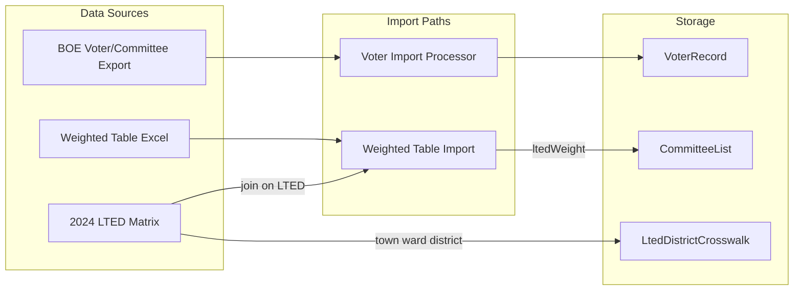

# LTED Weight Source — Specification

**February 2026**

This document captures the resolution of [SRS_GAPS_AND_CONSIDERATIONS.md](SRS_GAPS_AND_CONSIDERATIONS.md) §1.1 and specifies the MCDC Weighted Table as the authoritative source for LTED designation weights. It also documents the **2024 LTED Matrix**, which provides LTED → town/ward/district mapping and district crosswalk data. It supplements [SRS_IMPLEMENTATION_ROADMAP.md](SRS_IMPLEMENTATION_ROADMAP.md) items 1.4 and 2.7.

---

## 1. Resolution Summary

| Item | Resolution |
|------|------------|
| **Does BOE export include weight?** | No |
| **Weight source** | Separate MCDC-provided Excel file ("Weighted Table") |
| **Import path** | Admin upload or seed script (similar to LTED crosswalk in Gap 2.1) |
| **Fallback** | Admin manual entry when file not yet provided |
| **Related file** | 2024 LTED Matrix — provides town/ward/district per LTED; join with Weighted Table on LTED to resolve `cityTown` |

Weight does **not** come from the BOE voter/committee export. It comes from a **separate MCDC-provided Excel file** delivered periodically (e.g., post-election or as needed). A second file, the **2024 LTED Matrix**, maps each LTED to town code, ward, district, and district crosswalk (Assembly, Senate, Congressional) — use it to resolve `cityTown` when importing weights.

---

## 2. Weighted Table Format

**Reference file:** `Weighted Table 20250110.xlsx` (date in filename: 2025-01-10)

**Sheet name:** `Weighted Table 20250110`

**Row count:** 660 LTEDs

### 2.1 Column Structure

| Column | Header | Type | Description | Example |
|--------|--------|------|-------------|---------|
| A | LTED | String | Encoded LTED identifier = `legDistrict` + zero-padded `electionDistrict` | `04001`, `17002` |
| B | Comment | String | Source note (e.g., election used for weight calculation) | "Based on Democratic Vote for Member of Assembly in 2024" |
| C | Weighted Vote | Decimal | LTED total weight | `0`, `128.5`, `17.75` |
| D | LT | Integer | Leg District (redundant with LTED parse; useful for validation) | `4`, `17`, `21` |

### 2.2 LTED Code Parsing

Format: `{legDistrict}{electionDistrict}` (zero-padded as needed)

| LTED Code | Leg District | Election District |
|-----------|--------------|-------------------|
| 04001 | 4 | 1 |
| 16001 | 16 | 1 |
| 17001 | 17 | 1 |
| 17002 | 17 | 2 |
| 21005 | 21 | 5 |

### 2.3 Sample Rows

```
Row 1:  LTED | Comment | Weighted Vote | LT
Row 2:  04001 | Based on Democratic Vote for Member of Assembly in 2024 | 0 | 4
Row 3:  16001 | Based on Democratic Vote for Governor in 2022... | 2.75 | 16
Row 4:  17001 | Based on Democratic Vote for Member of Assembly in 2024 | 128.5 | 17
Row 5:  17002 | Based on Democratic Vote for Member of Assembly in 2024 | 17.75 | 17
```

---

## 3. 2024 LTED Matrix (Supplemental)

A second MCDC file provides **LTED → town/ward/district** mapping plus **district crosswalk** (Assembly, Senate, Congressional). Use it to resolve `cityTown` when importing the Weighted Table.

**Reference file:** `2024 LTED Matrix.xlsx`

**Sheet name:** `NEW_LTED_Matrix`

**Row count:** 660 LTEDs (same LTEDs as Weighted Table — can be joined)

### 3.1 Column Structure

| Column | Header | Type | Description | Example |
|--------|--------|------|-------------|---------|
| A | LTED | String | Same encoding as Weighted Table | `04001`, `17002` |
| B | ward | String | Leg District (zero-padded) | `004`, `017` |
| C | district | String | Election District (zero-padded) | `001`, `002` |
| D | town | String | Town/city code | `080`, `025`, `040` |
| E | cong_dist | String | Congressional district | `025` |
| F | stsen_dist | String | State Senate district | `055`, `056` |
| G | stleg_dist | String | State Assembly district | `136`, `137`, `138` |
| H | othr_dist1 | String | Other district 1 | `004`, `017` |
| I | othr_dist2 | String | Other district 2 (region?) | `NW`, `NE`, `E` |

### 3.2 Town Coverage

21 unique town codes in the file (e.g., `005`, `010`, `015`, `017`, `020`, `025`, `030`, `035`, `040`, `045`, `050`, `055`, `060`, `065`, `070`, `075`, `080`, `085`, `090`, `095`, `100`). Town `080` has 171 rows (likely Rochester). Town codes map to city/town names via a lookup (e.g., `DropdownLists.townCode` or MCDC-provided mapping).

### 3.3 Relationship to Other Data

- **LTED codes are unique** — one row per LTED; no duplicate LTEDs.
- **Join key with Weighted Table:** LTED (column A). Joining yields `(town, ward, district, weight, stleg_dist, stsen_dist, cong_dist)` per LTED.
- **LtedDistrictCrosswalk:** Columns D–G provide the crosswalk data (`town` → cityTown, `ward` → legDistrict, `district` → electionDistrict, `stleg_dist` → stateAssemblyDistrict, `stsen_dist` → stateSenateDistrict, `cong_dist` → congressionalDistrict).
- **Use for weight import:** When importing the Weighted Table, use the Matrix to resolve `(town, ward, district)` from LTED, then map town code → `cityTown` for `CommitteeList` matching.

---

## 4. Import Specification

### 4.1 Match Key

`CommitteeList` is uniquely keyed by `(cityTown, legDistrict, electionDistrict)`.

**Resolved:** The **2024 LTED Matrix** provides `(town, ward, district)` per LTED. The Weighted Table and Matrix share the same 660 LTEDs and can be joined.

**Import options:**

1. **Weighted Table + Matrix (recommended):** Join on LTED. Use Matrix to get `(town, ward, district)`. Map town code → `cityTown` (via `DropdownLists.townCode` or MCDC mapping). Match to `CommitteeList` by `(cityTown, legDistrict, electionDistrict)`.
2. **Weighted Table only:** Requires configured `cityTown` or assumption that `(legDistrict, electionDistrict)` is unique county-wide (not confirmed).
3. **Matrix only for crosswalk:** The Matrix can also populate `LtedDistrictCrosswalk` — see Gap 2.1.

**Town code → cityTown:** A lookup is required. Options: `DropdownLists.townCode` values, MCDC-provided mapping, or hardcoded Monroe County town codes (e.g., `apps/report-server/src/utils/absenteeDataUtils.ts` has Ward→Town for some towns).

### 4.2 Import Behavior

- Parse each row: extract `legDistrict`, `electionDistrict` from LTED code; read `weight` from column C.
- If using Matrix: join on LTED to get `(town, ward, district)`; map town code → `cityTown`.
- Match to `CommitteeList` by `(cityTown, legDistrict, electionDistrict)`.
- **Update** `CommitteeList.ltedWeight` for matching rows.
- **Skip or warn** for LTEDs in the file that have no matching CommitteeList (e.g., new ED not yet in system).
- **Skip or warn** for CommitteeLists with no weight in the file (e.g., missing row).

### 4.3 Term Association

Current schema: `ltedWeight` lives on `CommitteeList` (not term-specific). Weight may change between terms (redistricting, new election data). **v1 approach:** Overwrite `ltedWeight` when importing a new table; treat as "current" weight. Term-specific weight storage is a possible future enhancement.

---

## 5. Data Flow



---

## 6. Open Questions & Ambiguities

### 6.1 Town Code → cityTown Mapping (Moderate)

**Resolved:** The 2024 LTED Matrix provides town codes (e.g., `080`, `025`) per LTED.

**Remaining:** A lookup table or mapping is needed to convert town code → `cityTown` string (e.g., `080` → `Rochester`). Options: `DropdownLists.townCode`, MCDC-provided mapping, or extend `WARD_TO_TOWN_MAPPING`-style data. Confirm which source is authoritative.

### 6.2 Update Cadence

**Question:** How often does MCDC provide updated Weighted Table and/or LTED Matrix (e.g., post-election, annually)?

**Impact:** Operational; informs admin workflow and documentation.

### 6.3 Comment Column (Weighted Table)

**Question:** Should the Comment column be stored (e.g., in metadata) or only used for import logging?

**Impact:** Low; can default to "ignore" for v1.

---

## 7. Cross-References

| Document | Section | Reference |
|----------|---------|-----------|
| SRS_GAPS_AND_CONSIDERATIONS.md | §1.1 | Resolution: weight from Weighted Table, not BOE |
| SRS_IMPLEMENTATION_ROADMAP.md | 1.4 Seat Model | Store ltedWeight via Weighted Table import |
| SRS_IMPLEMENTATION_ROADMAP.md | 2.7 Weight / Designation Logic | Weight source and import path |
| SRS_DATA_MODEL_CHANGES.md | CommitteeList.ltedWeight | Source: MCDC Weighted Table or admin entry |
| SRS_v0.1_Committee_Membership_Governance.md | §8.1 | Each LTED has total weight (source clarified here) |
| SRS_GAPS_AND_CONSIDERATIONS.md | §2.1 | LTED Matrix provides crosswalk format/source for LtedDistrictCrosswalk |

---

## 8. Implementation Notes

- Add Weighted Table import to Roadmap 1.4 and 2.7 work items.
- **Recommended:** Support both Weighted Table and 2024 LTED Matrix. Join on LTED; use Matrix for `(town, ward, district)` → `(cityTown, legDistrict, electionDistrict)` matching.
- **Fallback:** Weighted Table only with optional `cityTown` parameter if Matrix not provided.
- LTED parsing: handle variable-length LD (1–2 digits) + 3-digit ED. Validate with column D (LT) when present.
- The Matrix can also populate `LtedDistrictCrosswalk` (Gap 2.1) — consider a unified "MCDC data import" flow for both weight and crosswalk.
- Town code lookup: implement or configure mapping; reference `DropdownLists.townCode` or MCDC spec.
