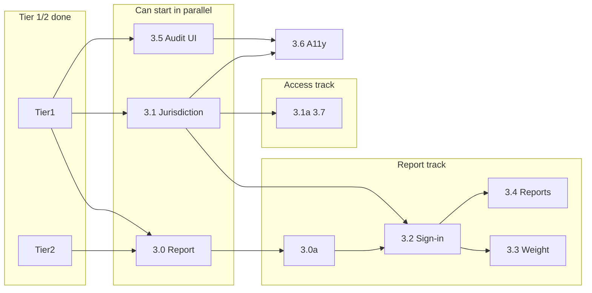

# SRS Implementation Tickets

**February 2026**

Implementation tickets for the MCDC Committee Membership & Governance system. Each ticket maps to a section in the [SRS_IMPLEMENTATION_ROADMAP.md](../SRS_IMPLEMENTATION_ROADMAP.md) and provides concrete acceptance criteria for implementation.

---

## Quick Start (New Implementers)

1. ~~[0.1 Backend enforcement](0.1-backend-enforcement-already-in-committee.md)~~ — **Done**
2. ~~[1.1 Committee Term Model](1.1-committee-term-model.md)~~ — **Done**
3. ~~[1.1b LTED-to-Assembly-District Mapping](1.1b-lted-assembly-district-mapping.md)~~ — **Done**
4. ~~[1.1c Committee Governance Config](1.1c-committee-governance-config.md)~~ — **Done**
5. ~~[1.2 CommitteeMembership Model](1.2-committee-membership-model.md)~~ — **Done**
6. ~~[1.3 Membership Type](1.3-membership-type.md)~~ — **Done**
7. ~~[1.4 Seat Model](1.4-seat-model.md)~~ — **Done**
8. ~~[1.5 Audit Trail Infrastructure](1.5-audit-trail-infrastructure.md)~~ — **Done** (1.5a → 1.5b → 1.5c)
9. ~~[1.R.1 Leader Privilege Escalation](1.R.1-leader-privilege-escalation.md)~~ — **Resolved**
10. ~~[1.R.2 requestAdd Resubmission for Non-Active Memberships](1.R.2-requestAdd-resubmission-non-active.md)~~ — **Resolved**
11. ~~[1.R.3 Replacement Flow Not Implemented](1.R.3-replacement-flow-not-implemented.md)~~ — **Resolved**
12. ~~[1.R.4 Bulk Import Incompatible with Phase 1 Schema](1.R.4-bulk-import-phase1-incompatible.md)~~ — **Resolved**
13. ~~[1.R.5 Source-of-Truth Split](1.R.5-source-of-truth-split.md)~~ — **Resolved**
14. ~~[1.R.6 Audit Tests Fail](1.R.6-audit-tests-fail.md)~~ — **Resolved**
15. ~~[1.R.7 Capacity + Seat Assignment Non-Atomic](1.R.7-capacity-seat-assignment-non-atomic.md)~~ — **Resolved**
16. ~~[1.R.8 Phase 1 Remediation Closeout (Tests + Docs)](1.R.8-phase1-remediation-closeout.md)~~ — **Resolved**
17. ~~[1.R.9 FormData Support for useApiMutation](1.R.9-formdata-support-for-use-api-mutation.md)~~ — **Resolved**
18. ~~[1.R.10 updateLtedWeight Atomicity for Weight Recompute](1.R.10-update-lted-weight-atomic-recompute.md)~~ — **Resolved**
19. ~~[1.R.11 Admin GET Data Hook Standardization](1.R.11-admin-get-hook-standardization.md)~~ — **Resolved**
20. ~~[1.R.12 Drop Redundant LTED Crosswalk Index](1.R.12-drop-redundant-lted-crosswalk-index.md)~~ — **Resolved**
21. ~~[1.R.13 Phase 1 Migration / Schema Fixes](1.R.13-phase1-migration-fixes.md)~~ — **Resolved**
22. ~~[1.R.14 handleRequest Capacity Check for Replacement](1.R.14-handleRequest-capacity-replacement.md)~~ — **Resolved**
23. ~~[1.R.15 API and Audit Robustness](1.R.15-api-audit-robustness.md)~~ — **Resolved**
24. ~~[1.R.16 useApiQuery Type Safety and Cleanup](1.R.16-useApiQuery-robustness.md)~~ — **Resolved**
25. ~~[1.R.17 Phase 1 Admin and Committee UI Fixes](1.R.17-phase1-ui-fixes.md)~~ — **Resolved**
26. ~~[1.R.18 Phase 1 Tests and Validations](1.R.18-phase1-tests-validations.md)~~ — **Resolved**
27. ~~[1.R.19 Phase 1 Doc Consistency](1.R.19-phase1-doc-consistency.md)~~ — **Resolved**
28. ~~[1.R.20 Admin Flow Audit Coverage](1.R.20-admin-flow-audit-coverage.md)~~ — **Resolved**
29. ~~[1.R.21 High-Risk Route Test Coverage](1.R.21-high-risk-route-test-coverage.md)~~ — **Done**
30. ~~[2.1 Eligibility Validation](2.1-eligibility-validation.md)~~ — **Done**
31. ~~[2.2 Warning System](2.2-warning-system.md)~~ — **Done**
32. ~~[2.5 Structured Removal with Reasons](2.5-structured-removal-reasons.md)~~ — **Done**
33. ~~[2.4 Meeting Record + Executive Confirmation Workflow](2.4-meeting-record-confirmation-workflow.md)~~ — **Done**
34. ~~[2.6 Petition + Primary Outcome Tracking](2.6-petition-primary-outcome-tracking.md)~~ — **Done**
35. ~~[2.7 Weight / Designation Logic](2.7-weight-designation-logic.md)~~ — **Done**
36. ~~[3.0 Report-server Migration](3.0-report-server-committee-membership-migration.md)~~ — **Done**
37. ~~[3.0a Report Audit](3.0a-report-audit-committee-membership.md)~~ — **Done**
38. **Current queue:** 2.8–2.9, 3.1–3.7, T1.4–T1.5, T2.1–T2.4

---

## Ticket Index

### Tier 0 — Done

| ID | Title | Status | Roadmap |
| --- | --- | --- | --- |
| [0.1](0.1-backend-enforcement-already-in-committee.md) | Backend enforcement for "Already in Another Committee" | Done | Tier 0 §0.1 |

### Tier 1 — Foundation

| ID | Title | Status | Roadmap |
| --- | --- | --- | --- |
| [1.1](1.1-committee-term-model.md) | Committee Term Model | Done | Tier 1 §1.1 |
| [1.1b](1.1b-lted-assembly-district-mapping.md) | LTED-to-Assembly-District Mapping | Done | Tier 1 §1.1b |
| [1.1c](1.1c-committee-governance-config.md) | Committee Governance Config | Done | Tier 1 §1.1c |
| [1.2](1.2-committee-membership-model.md) | CommitteeMembership Model | Done | Tier 1 §1.2 |
| [1.3](1.3-membership-type.md) | Membership Type (Petitioned vs. Appointed) | Done | Tier 1 §1.3 |
| [1.4](1.4-seat-model.md) | Seat Model | Done | Tier 1 §1.4 |
| [1.5](1.5-audit-trail-infrastructure.md) | Audit Trail Infrastructure | Done | Tier 1 §1.5 |
| [1.5a](1.5a-audit-log-schema-and-seed.md) | ↳ AuditLog Schema & SYSTEM User Seed | Done | Tier 1 §1.5 |
| [1.5b](1.5b-audit-log-utility-and-immutability.md) | ↳ Audit Log Utility & Immutability Guard | Done | Tier 1 §1.5 |
| [1.5c](1.5c-audit-log-route-wiring.md) | ↳ Audit Log Route Wiring | Done | Tier 1 §1.5 |

### Tier 1 — Testing

| ID | Title | Status | Roadmap |
| --- | --- | --- | --- |
| [T1.1](T1.1-handleRequest-route-tests.md) | handleRequest Route Tests | Done | Testing Tier 1 §T1.1 |
| [T1.2](T1.2-report-generation-api-tests.md) | Report Generation API Tests | Done | Testing Tier 1 §T1.2 |
| [T1.3](T1.3-discrepancy-handling-tests.md) | Committee Discrepancy Handling Tests | Done | Testing Tier 1 §T1.3 |
| [T1.4](T1.4-voter-import-processor-tests.md) | Voter Import Processor Tests | Open | Testing Tier 1 §T1.4 |
| [T1.5](T1.5-report-server-core-tests.md) | Report-Server Core Tests | Open | Testing Tier 1 §T1.5 |

### Tier 2 — Testing

| ID | Title | Status | Roadmap |
| --- | --- | --- | --- |
| [T2.1](T2.1-committee-selector-component-tests.md) | CommitteeSelector Component Tests | Open | Testing Tier 2 §T2.1 |
| [T2.2](T2.2-add-committee-form-component-tests.md) | AddCommitteeForm Component Tests | Open | Testing Tier 2 §T2.2 |
| [T2.3](T2.3-committee-request-components-tests.md) | CommitteeRequestForm and RequestCard Tests | Open | Testing Tier 2 §T2.3 |
| [T2.4](T2.4-report-generation-forms-tests.md) | Report Generation Forms Tests | Open | Testing Tier 2 §T2.4 |

### Tier 1 — Admin IA

| ID | Title | Status | Roadmap |
| --- | --- | --- | --- |
| [IA-01](IA-01-admin-ia-v1-spec.md) | Admin IA v1 spec | Done | SRS_UI_PLANNING_GAPS §16 |

### Phase 1 — Remediation (Bugs / Gaps from Scope Check)

| ID | Title | Status | Priority | Depends on |
| --- | --- | --- | --- | --- |
| [1.R.1](1.R.1-leader-privilege-escalation.md) | Leader Privilege Escalation | Resolved | P0 (Critical) | — |
| [1.R.2](1.R.2-requestAdd-resubmission-non-active.md) | requestAdd Resubmission for Non-Active Memberships | Resolved | P1 | 1.2 |
| [1.R.3](1.R.3-replacement-flow-not-implemented.md) | Replacement Flow Not Implemented in handleRequest | Resolved | P1 | 1.2, T1.1 |
| [1.R.4](1.R.4-bulk-import-phase1-incompatible.md) | Bulk Import Incompatible with Phase 1 Schema | Resolved | P1 | 1.2, 1.4 |
| [1.R.5](1.R.5-source-of-truth-split.md) | Source-of-Truth Split (committeeMemberList vs CommitteeMembership) | Resolved | P1 | 1.2, 1.R.4 |
| [1.R.6](1.R.6-audit-tests-fail.md) | Audit Tests Fail (AuditAction Undefined) | Resolved | P2 | 1.5b |
| [1.R.7](1.R.7-capacity-seat-assignment-non-atomic.md) | Capacity + Seat Assignment Non-Atomic (Race Risk) | Resolved | P2 | 1.2, 1.4 |
| [1.R.8](1.R.8-phase1-remediation-closeout.md) | Phase 1 Remediation Closeout (Tests + Docs) | Resolved | P1 | 1.R.4, 1.R.5, 1.R.7 |
| [1.R.9](1.R.9-formdata-support-for-use-api-mutation.md) | FormData Support for useApiMutation | Resolved | P2 | 1.4 |
| [1.R.10](1.R.10-update-lted-weight-atomic-recompute.md) | updateLtedWeight Atomicity for Weight Recompute | Resolved | P2 | 1.4 |
| [1.R.11](1.R.11-admin-get-hook-standardization.md) | Admin GET Data Hook Standardization | Resolved | P3 | IA-01 |
| [1.R.12](1.R.12-drop-redundant-lted-crosswalk-index.md) | Drop Redundant LTED Crosswalk Index | Resolved | P3 | 1.1b |
| [1.R.13](1.R.13-phase1-migration-fixes.md) | Phase 1 Migration / Schema Fixes | Resolved | P2 | 1.1c, 1.1, 1.5 |
| [1.R.14](1.R.14-handleRequest-capacity-replacement.md) | handleRequest Capacity Check for Replacement | Resolved | P2 | 1.2, 1.4 |
| [1.R.15](1.R.15-api-audit-robustness.md) | API and Audit Robustness | Resolved | P2 | 1.4, 1.5 |
| [1.R.16](1.R.16-useApiQuery-robustness.md) | useApiQuery Type Safety and Cleanup | Resolved | P2 | — |
| [1.R.17](1.R.17-phase1-ui-fixes.md) | Phase 1 Admin and Committee UI Fixes | Resolved | P2 | 1.1, 1.2 |
| [1.R.18](1.R.18-phase1-tests-validations.md) | Phase 1 Tests and Validations | Resolved | P2 | 1.2, 1.4 |
| [1.R.19](1.R.19-phase1-doc-consistency.md) | Phase 1 Doc Consistency | Resolved | P3 | — |
| [1.R.20](1.R.20-admin-flow-audit-coverage.md) | Admin Flow Audit Coverage | Resolved | P2 | 1.5 |
| [1.R.21](1.R.21-high-risk-route-test-coverage.md) | High-Risk Route Test Coverage | Done | P2 | 1.R.20, 1.4 |

### Tier 2 — Lifecycle Workflows

| ID | Title | Status | Roadmap | Depends on |
| --- | --- | --- | --- | --- |
| [2.1](2.1-eligibility-validation.md) | Eligibility Validation (Hard Stops) | Done | Tier 2 §2.1 | 1.1b, 1.1c, 1.2 |
| [2.1a](2.1a-email-phone-submission.md) | Email/Phone During Leader Submission | Done | Tier 2 §2.1a | 1.2 |
| [2.2](2.2-warning-system.md) | Warning System (Non-blocking Eligibility Warnings) | Done | Tier 2 §2.2 | 2.1, 1.2 |
| [2.3](2.3-resignation-workflow.md) | Resignation Workflow | Done | Tier 2 §2.3 | 1.2, 1.4 |
| [2.4](2.4-meeting-record-confirmation-workflow.md) | Meeting Record + Executive Confirmation Workflow | Done | Tier 2 §2.4 | 1.2, 1.4, IA-01 |
| [2.5](2.5-structured-removal-reasons.md) | Structured Removal with Reasons | Done | Tier 2 §2.5 | 1.2, 2.3 |
| [2.6](2.6-petition-primary-outcome-tracking.md) | Petition + Primary Outcome Tracking | Done | Tier 2 §2.6 | 1.2, 1.3, 1.4, 2.4 |
| [2.7](2.7-weight-designation-logic.md) | Weight / Designation Logic | Done | Tier 2 §2.7 | 1.4, 2.6 |
| [2.8](2.8-boe-driven-automatic-eligibility-flagging.md) | BOE-Driven Automatic Eligibility Flagging | Done | Tier 2 §2.8 | 1.2, 2.1, 2.2, 2.5 |
| [2.9](2.9-serve-ed-vs-home-ed-resolution.md) | Serve ED vs Home ED Resolution | Open | Tier 2 follow-up | 2.1, 3.1 |

### Tier 3 — Workflows, Reports & Access Control

| ID | Title | Status | Roadmap | Depends on |
| --- | --- | --- | --- | --- |
| [3.0](3.0-report-server-committee-membership-migration.md) | Report-server: Migrate ldCommittees to CommitteeMembership | Done | Tier 3 §3.0 | 1.2 |
| [3.0a](3.0a-report-audit-committee-membership.md) | Audit and Update All Reports for CommitteeMembership | Done | Tier 3 §3.0a | 3.0 |
| [3.1](3.1-jurisdiction-assignment-ui.md) | Jurisdiction Assignment UI (Leader Access) | Open | Tier 3 §3.1 | 1.1, IA-01 |
| [3.1a](3.1a-committee-selector-vacancy-weight-empty-states.md) | CommitteeSelector Vacancy/Weight + Empty States | Open | Tier 3 §3.1a | 2.7, 3.1 |
| [3.2](3.2-sign-in-sheet-report-ui.md) | Sign-In Sheet Report UI | Open | Tier 3 §3.2 | 3.0, 3.0a, 3.1 |
| [3.3](3.3-designation-weight-summary-report-ui.md) | Designation Weight Summary Report UI | Open | Tier 3 §3.3 | 2.7, 3.2 |
| [3.4](3.4-vacancy-changes-petition-reports-ui.md) | Vacancy, Changes, and Petition Outcomes Reports UI | Open | Tier 3 §3.4 | 2.6, 3.2 |
| [3.5](3.5-audit-trail-ui-export.md) | Audit Trail UI and Export | Open | Tier 3 §3.5 | 1.5 |
| [3.6](3.6-mobile-accessibility-baseline.md) | Mobile and Accessibility Baseline | Open | Tier 3 quality gate | 3.1, 3.5 |
| [3.7](3.7-lted-crosswalk-import-ui.md) | LTED Crosswalk Import UI/Admin Flow | Open | Tier 3 follow-up | 1.1b, 3.1 |

### Tier 3 parallelization

Three tracks can be started in parallel (each depends only on done Tier 1/2 work). Assign by track to avoid blocking.

| Track | Tickets | Notes |
| ----- | ------- | ----- |
| **Report** | 3.0 → 3.0a → 3.2 → 3.3, 3.4 | Do 3.0a in same sprint as 3.0 (recommended). After 3.2, 3.3 and 3.4 can run in parallel. |
| **Access** | 3.1 → 3.1a, 3.7 | After 3.1, 3.1a and 3.7 can run in parallel. |
| **Audit** | 3.5 | Standalone; depends only on 1.5. |

**Gate:** 3.6 (Mobile/A11y baseline) runs after both 3.1 and 3.5 are done.

**Can start in parallel:** 3.0, 3.1, 3.5.

---

## Dependency Summary

```
1.1 (done) ──► 1.2 (done) ──► 1.3 (done)
                │  ──► 2.1 (done) ──► 2.2 (done) ──► 2.8 (done)
                │  ──► 2.1a (done)
                │  ──► 2.3 (done) ──► 2.5 (done) ──► 2.8 (done)
                │
                └──► 2.4 ──► 2.6 ──► 2.7
                │
1.1b (done) ──► 2.1
1.1c (done) ──► 1.4 (done, also needs 1.2) ──► 2.3, 2.4, 2.6, 2.7
                │
                └──► 1.5a (done) ──► 1.5b (done) ──► 1.5c (done)

Tier 3 (all assume Tier 1/2 done):
  3.0 ──► 3.0a ──► 3.2 ──► 3.3
                  └──► 3.4
  3.1 ──► 3.1a, 3.7
  3.2 also depends on 3.1 (frontend scope/jurisdiction)
  1.5 ──► 3.5
  3.1 + 3.5 ──► 3.6

  Parallel starts: 3.0 | 3.1 | 3.5
  (3.0a recommended same sprint as 3.0)

T1.4, T1.5 — open, parallel test hardening
T2.1, T2.2, T2.3, T2.4 — open UI coverage batch

Phase 1 Remediation (1.R.x):
  1.R.1–1.R.20 — resolved
  1.R.21 — done

Tier 2:
  2.1, 2.2, 2.3, 2.4, 2.5, 2.6, 2.7 — done; 2.8–2.9 — open

Tier 3:
  3.0–3.7 — open
```



---

## Roadmap Reference

See [SRS_IMPLEMENTATION_ROADMAP.md](../SRS_IMPLEMENTATION_ROADMAP.md) for the full implementation sequence, dependencies, and timeline.

**Implementation plan:** [IA-01-implementation-action-items.md](../IA-01-implementation-action-items.md) — suggested action items and decisions from the IA-01 ticket.
