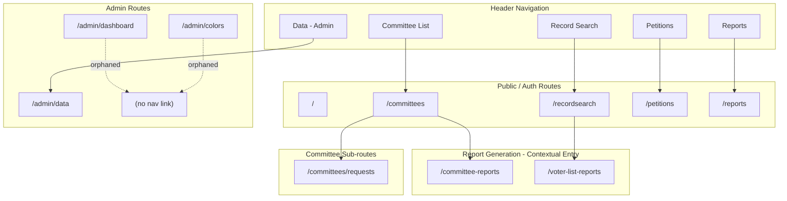
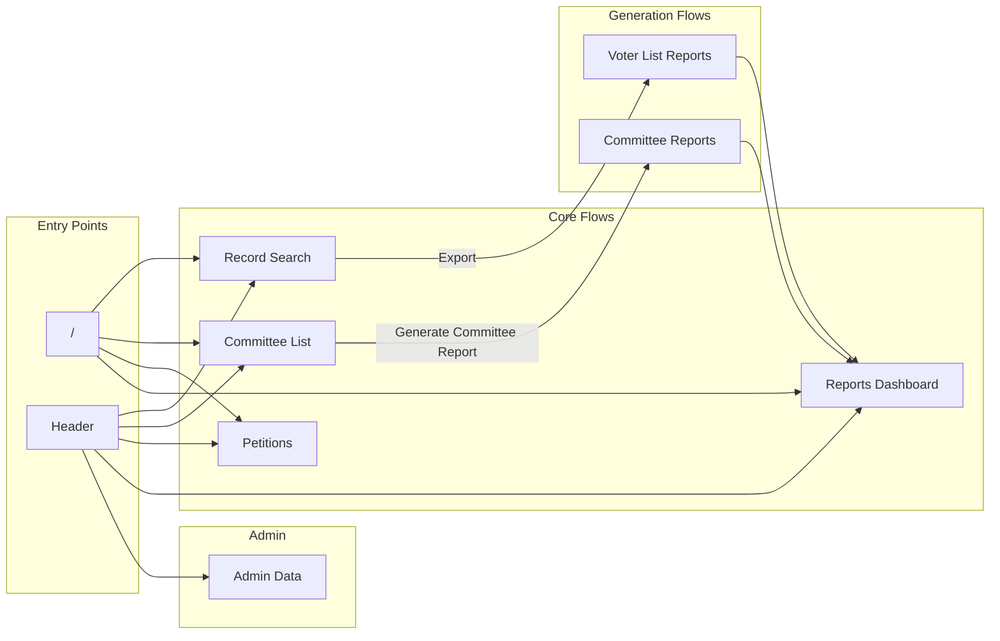
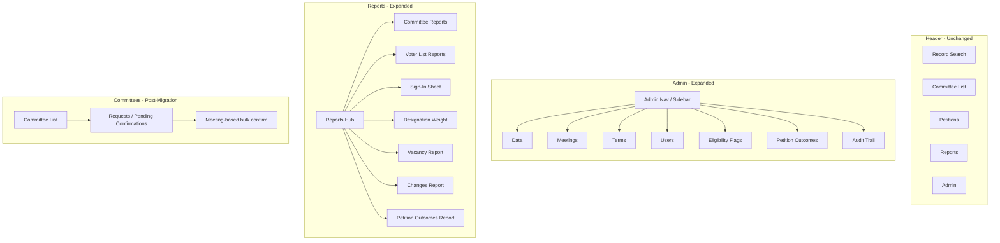
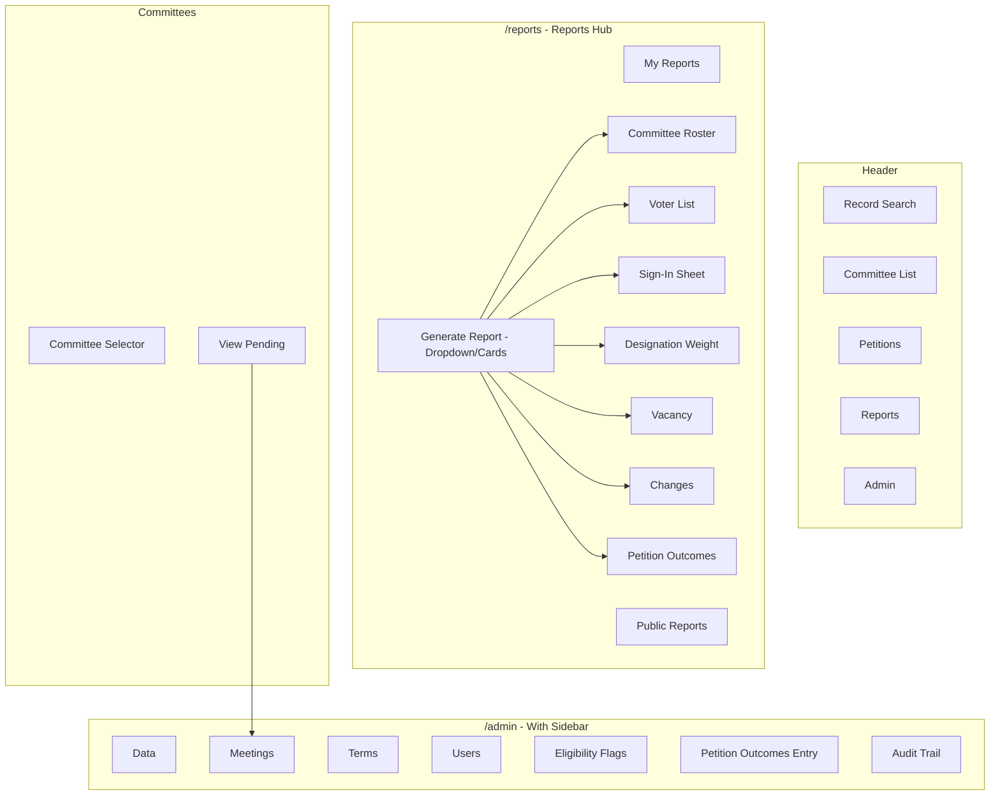

# UI Architecture Review — Information Architecture

**February 2026**

This document defines the current and planned information architecture, with a Mermaid diagram and analysis of navigation structure. References: [SRS_UI_PLANNING_GAPS.md](../SRS/SRS_UI_PLANNING_GAPS.md) §16, [SRS_IMPLEMENTATION_ROADMAP.md](../SRS/SRS_IMPLEMENTATION_ROADMAP.md).

---

## 1. Current IA Diagram



---

## 2. Current Navigation Map (Detailed)



---

## 3. Planned IA (Post-SRS Roadmap)

Per [SRS_IMPLEMENTATION_ROADMAP.md](../SRS/SRS_IMPLEMENTATION_ROADMAP.md) and [SRS_UI_PLANNING_GAPS.md](../SRS/SRS_UI_PLANNING_GAPS.md), these **new** admin sections are planned:

| Planned Route/Section                              | Roadmap Ref | Purpose                                                          |
| -------------------------------------------------- | ----------- | ---------------------------------------------------------------- |
| `/admin/meetings` (or similar)                     | 2.4         | Meeting record creation; bulk confirm/reject pending submissions |
| `/admin/terms`                                     | 1.1         | Create/manage committee terms                                    |
| `/admin/users` (or extend invites)                 | 3.1         | Assign jurisdictions to Leader users                             |
| `/admin/eligibility-flags` (or section under data) | 2.8         | BOE eligibility flag review queue                                |
| `/admin/petitions` or `/admin/petition-outcomes`   | 2.6         | Petition outcome entry (challengers, results)                    |
| `/admin/audit`                                     | 3.5         | Audit trail viewer, filter, export                               |
| `/admin/data` — crosswalk import                   | 1.1b        | LTED crosswalk import (format TBD)                               |

### Planned Reports (Roadmap 3.2–3.4)

| Report Type              | Access                | Parameters                     |
| ------------------------ | --------------------- | ------------------------------ |
| SignInSheet              | Admin/Leader (scoped) | Jurisdiction, date             |
| DesignationWeightSummary | Admin/Leader          | Scope (county vs jurisdiction) |
| VacancyReport            | Admin/Leader          | Scope, filters                 |
| ChangesReport            | Admin/Leader          | Date range                     |
| PetitionOutcomesReport   | Admin/Leader          | Term, date range               |

---

## 4. Proposed v1 IA (Recommendation)



---

## 5. IA Gaps and Decisions Needed

### 5.1 Admin Section Structure

**Current:** Single "Data" tab linking to `/admin/data` with 5 sub-tabs.

**Planned additions (Roadmap):** Meetings, Terms, Users, Eligibility, Petition Outcomes, Audit, Crosswalk import.

**Options:**

1. **Tabs only** — Add more tabs to Admin Data. Becomes crowded (10+ tabs).
2. **Admin sidebar** — `/admin` layout with sidebar: Data | Meetings | Terms | Users | Eligibility | Petitions | Audit. Each section can have sub-routes.
3. **Nested routes** — `/admin/data`, `/admin/meetings`, `/admin/terms`, etc. Header "Admin" dropdown or single Admin tab that navigates to dashboard with links.

**Recommendation:** Introduce `/admin` layout with sidebar for v1 expansion. Data tab becomes "Data" section (invites, discrepancies, election dates, offices, special reports, crosswalk). New sections: Meetings, Terms, Users, Eligibility, Petition Outcomes, Audit.

### 5.2 Reports Hub

**Current:** `/reports` lists existing reports. No links to generate new reports.

**Planned:** Multiple new report types.

**Recommendation:** Add "Generate Report" dropdown or card grid on `/reports`:

- Committee Roster (PDF/XLSX) → `/committee-reports`
- Voter List (XLSX) → `/voter-list-reports` (requires search first; show message)
- Sign-In Sheet → (new)
- Designation Weight Summary → (new)
- Vacancy Report → (new)
- Changes Report → (new)
- Petition Outcomes Report → (new)

Each link explains context (e.g., "From Record Search" for voter list).

### 5.3 Requests Page Fate

**Current:** `/committees/requests` — accordion by committee, RequestCard per request, Accept/Reject.

**Planned (Roadmap 2.4):** Meeting-based bulk confirmation. Create meeting → attach pending submissions → bulk confirm/reject.

**Options:**

1. Replace requests page with meeting management page. Requests become a sub-step of "create meeting + select pendings."
2. Keep requests page for quick one-off accept/reject; add separate "Meetings" page for bulk workflow.
3. Merge: Requests page shows pending; "Create Meeting" action opens flow to create meeting and attach selected requests; bulk confirm from meeting view.

**Recommendation:** Under IA diagram, create `/admin/meetings` as primary workflow. Requests page could redirect to meetings with a "pending" filter, or remain as a simplified view for admins who prefer one-off actions. Clarify in implementation spec.

### 5.4 Petition Overlap

**Current:** `/petitions` — designated petition form generation (PDF).

**Planned:** `/admin/petition-outcomes` (or similar) — record petition challengers and primary results.

**Naming risk:** "Petitions" in header = form generation. "Petition Outcomes" = outcome entry. Different purposes. Consider:

- Header "Petitions" → form generation (current)
- Admin section "Petition Outcomes" or "Petition Results" — no confusion with form generation
- Or: "Designated Petition Forms" vs "Petition Outcome Entry"

---

## 6. Mermaid: Full Proposed IA (v1)



---

## 7. Tab Highlighting Fix (Current)

**Issue:** Reports tab does not highlight when on `/committee-reports` or `/voter-list-reports`.

**Fix:** Change condition from:

```ts
pathname?.endsWith('reports') &&
  !pathname?.endsWith('committee-reports') &&
  !pathname?.endsWith('voter-list-reports');
```

To:

```ts
pathname?.includes('/reports') ||
  pathname?.includes('committee-reports') ||
  pathname?.includes('voter-list-reports');
```

Or more simply: `pathname?.includes("report")` (careful: could match unrelated routes).

**Safer:** `["/reports", "/committee-reports", "/voter-list-reports"].some(p => pathname?.startsWith(p))`

Similarly for Committee tab: include `/committees/requests`.

---

_Next: [03_RECOMMENDATIONS.md](03_RECOMMENDATIONS.md) for categorized recommendations._
