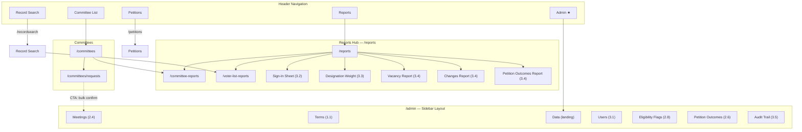
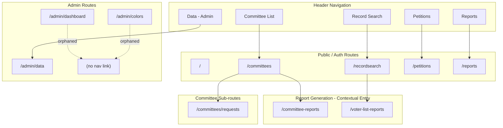
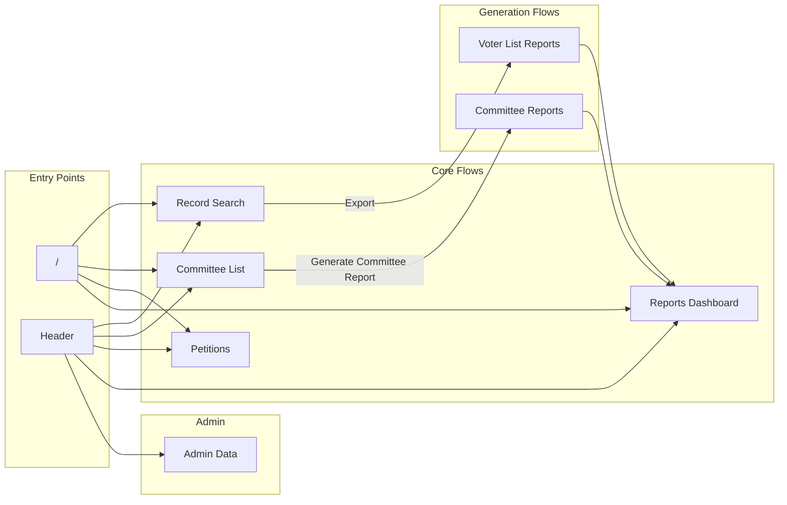
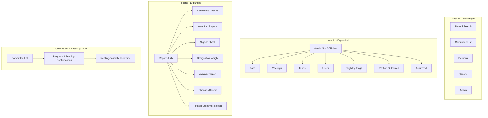
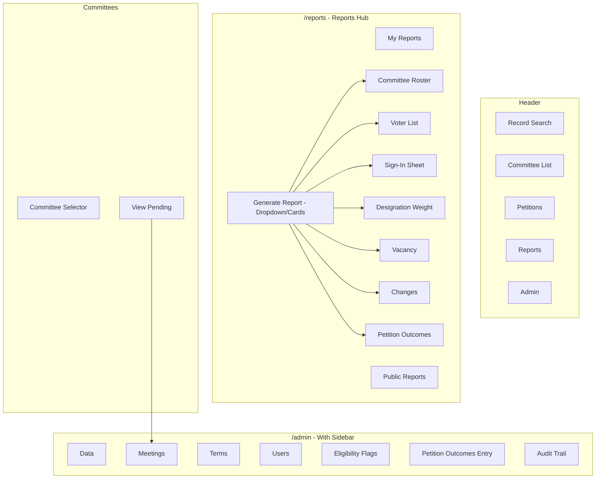

# UI Architecture Review — Information Architecture

**February 2026**

This document defines the current and planned information architecture, with a Mermaid diagram and analysis of navigation structure. References: [SRS_UI_PLANNING_GAPS.md](../SRS/SRS_UI_PLANNING_GAPS.md) §16, [SRS_IMPLEMENTATION_ROADMAP.md](../SRS/SRS_IMPLEMENTATION_ROADMAP.md).

---

## v1 IA Summary

This section consolidates confirmed decisions for the v1 information architecture. For detailed implementation action items, see [IA-01-implementation-action-items.md](../SRS/IA-01-implementation-action-items.md).

### Confirmed Decisions

| Decision | Choice |
|----------|--------|
| Admin navigation | **Sidebar layout** at `/admin`; tabs rejected (7+ sections makes tabs unwieldy) |
| Header "Data" tab | Rename to **"Admin"**, link to `/admin` |
| Admin landing page | Data content serves as landing page at `/admin` (no separate dashboard) |
| Requests page fate | **Keep** `/committees/requests` as simplified one-off view; primary bulk workflow moves to `/admin/meetings` (phased — see [§5.3](#53-requests-page-phased-transition)) |
| New report types | Add to `/reports` hub as "Generate Report" card grid; each report type gets a dedicated route under `/reports/` |
| Petition naming | Header "Petitions" = form generation; Admin sidebar "Petition Outcomes" = outcome entry |
| Orphaned routes | `/admin/dashboard` and `/admin/colors` — remove or integrate into sidebar |
| Sidebar visibility | Config-driven; all planned sections shown; unimplemented = "Coming soon" badge |
| Mobile sidebar | Collapsible hamburger using `Sheet` (side: left) |
| Data sub-tabs | Split "Special Reports" → "Voter Import" + "Absentee Report"; merge "Election Dates" + "Office Names" → "Election Config" |

### v1 Route Map

```
Header Navigation:
├── Record Search         → /recordsearch
├── Committee List        → /committees
│   └── Requests          → /committees/requests
├── Petitions             → /petitions            (form generation)
├── Reports               → /reports              (hub + generated reports list)
│   ├── Committee Reports → /committee-reports
│   └── Voter List Reports → /voter-list-reports
└── Admin                 → /admin                (sidebar layout)
    ├── Data              → /admin                (sub-tabs: Invites, Election Config, Voter Import, Discrepancies, Absentee Report)
    ├── Terms             → /admin/terms          (Roadmap 1.1)
    ├── Meetings          → /admin/meetings       (Roadmap 2.4)
    ├── Users             → /admin/users          (Roadmap 3.1)
    ├── Eligibility       → /admin/eligibility-flags (Roadmap 2.8)
    ├── Petition Outcomes → /admin/petition-outcomes (Roadmap 2.6)
    └── Audit Trail       → /admin/audit          (Roadmap 3.5)
```

### v1 IA Diagram



---

## 1. Current IA Diagram



---

## 2. Current Navigation Map (Detailed)



---

## 3. Planned IA (Post-SRS Roadmap)

Per [SRS_IMPLEMENTATION_ROADMAP.md](../SRS/SRS_IMPLEMENTATION_ROADMAP.md) and [SRS_UI_PLANNING_GAPS.md](../SRS/SRS_UI_PLANNING_GAPS.md), these **new** admin sections are planned:

| Planned Route/Section                              | Roadmap Ref | Purpose                                                          |
| -------------------------------------------------- | ----------- | ---------------------------------------------------------------- |
| `/admin/meetings` (or similar)                     | 2.4         | Meeting record creation; bulk confirm/reject pending submissions |
| `/admin/terms`                                     | 1.1         | Create/manage committee terms                                    |
| `/admin/users` (or extend invites)                 | 3.1         | Assign jurisdictions to Leader users                             |
| `/admin/eligibility-flags` (or section under data) | 2.8         | BOE eligibility flag review queue                                |
| `/admin/petitions` or `/admin/petition-outcomes`   | 2.6         | Petition outcome entry (challengers, results)                    |
| `/admin/audit`                                     | 3.5         | Audit trail viewer, filter, export                               |
| `/admin/data` — crosswalk import                   | 1.1b        | LTED crosswalk import (format TBD)                               |

### Planned Reports (Roadmap 3.2–3.4)

| Report Type              | Access                | Parameters                     |
| ------------------------ | --------------------- | ------------------------------ |
| SignInSheet              | Admin/Leader (scoped) | Jurisdiction, date             |
| DesignationWeightSummary | Admin/Leader          | Scope (county vs jurisdiction) |
| VacancyReport            | Admin/Leader          | Scope, filters                 |
| ChangesReport            | Admin/Leader          | Date range                     |
| PetitionOutcomesReport   | Admin/Leader          | Term, date range               |

---

## 4. Proposed v1 IA (Recommendation)



---

## 5. IA Decisions

### 5.1 Admin Section Structure

**Decision: Sidebar layout at `/admin`.**

**Current:** Single "Data" tab linking to `/admin/data` with 5 sub-tabs.

**Planned additions (Roadmap):** Meetings, Terms, Users, Eligibility, Petition Outcomes, Audit, Crosswalk import.

**Options considered:**

1. ~~**Tabs only**~~ — Rejected. 10+ tabs becomes crowded and unwieldy.
2. **Admin sidebar** — `/admin` layout with sidebar. **Selected.** Scales well, supports nested routes, matches common admin UI patterns.
3. ~~**Nested routes with dropdown**~~ — Rejected. Sidebar is more discoverable than a dropdown.

**v1 sidebar sections:** Data (landing) | Terms | Meetings | Users | Eligibility Flags | Petition Outcomes | Audit Trail. Config-driven — unimplemented sections show "Coming soon" badge. See [IA-01 action items AC2](../SRS/IA-01-implementation-action-items.md#ac2-define-placement-of-new-admin-pages) for implementation details.

### 5.2 Reports Hub

**Decision: "Generate Report" card grid on `/reports`.**

**Current:** `/reports` lists existing reports. No links to generate new reports.

`/reports` hub will display a "Generate Report" section with cards linking to each report type:

- Committee Roster (PDF/XLSX) → `/committee-reports`
- Voter List (XLSX) → `/voter-list-reports` (note: "Requires search from Record Search first")
- Designated Petition → `/petitions`
- Sign-In Sheet → `/sign-in-sheet-reports` (3.2 Done)
- Designation Weight Summary → `/weight-summary-reports` (3.3 Done)
- Vacancy Report → (new; Roadmap 3.4)
- Changes Report → (new; Roadmap 3.4)
- Petition Outcomes Report → (new; Roadmap 3.4)

Each card explains context. New report types get per-type routes (e.g., `/reports/sign-in-sheet`).

#### Report Parameters Matrix

| Report Type | UI Label | Route | Parameters | Defaults | Access | Roadmap |
|-------------|----------|-------|------------|----------|--------|---------|
| `CommitteeReport` | Committee Roster | `/committee-reports` | Committee selection, format (PDF/XLSX) | — | All authenticated | Existing |
| `VoterList` | Voter List | `/voter-list-reports` | Search criteria (from Record Search) | — | All authenticated | Existing |
| `DesignatedPetition` | Designated Petition | `/petitions` | Committee, term | — | All authenticated | Existing |
| `SignInSheet` | Sign-In Sheet | `/sign-in-sheet-reports` | Jurisdiction, date | Current user jurisdiction, today | Admin: all jurisdictions; Leader: own jurisdiction | 3.2 (Done) |
| `DesignationWeightSummary` | Designation Weight Summary | `/weight-summary-reports` | Scope (county / jurisdiction), format (PDF/XLSX) | County (Admin), own jurisdiction (Leader); XLSX | Admin: county + any jurisdiction; Leader: own jurisdiction | 3.3 (Done) |
| `VacancyReport` | Vacancy Report | `/reports/vacancy` | Scope, committee filter | All committees in scope | Admin: countywide; Leader: own jurisdiction | 3.4 |
| `ChangesReport` | Changes Report | `/reports/changes` | Date range (start, end) | Last 30 days | Admin: countywide; Leader: own jurisdiction | 3.4 |
| `PetitionOutcomesReport` | Petition Outcomes | `/reports/petition-outcomes` | Term, date range | Current term, all dates | Admin: countywide; Leader: own jurisdiction | 3.4 |

**Access control behavior:** For Leader users, scope/jurisdiction parameters are auto-set to their assigned jurisdiction and hidden or disabled. Admin users see a jurisdiction picker to choose scope.

### 5.3 Requests Page — Phased Transition

**Decision: Keep `/committees/requests`; add `/admin/meetings` as primary bulk workflow.**

**Current:** `/committees/requests` — accordion by committee, RequestCard per request, Accept/Reject.

**Phased transition plan:**

1. **Phase 1 (now):** No changes to `/committees/requests`. Continues to work with the existing `CommitteeRequest` model.
2. **Phase 2 (Roadmap 1.2 — Membership Status):** `/committees/requests` reads `CommitteeMembership` records with status `SUBMITTED` instead of `CommitteeRequest` records. Same UI, new data source.
3. **Phase 3 (Roadmap 2.4 — Meeting Record):** `/admin/meetings` becomes the primary bulk confirmation workflow. `/committees/requests` remains as a simplified one-off view. Add a CTA link from requests page: "For bulk confirmation, go to Meeting Management."

### 5.4 Petition Naming

**Decision: Header "Petitions" = form generation; Admin "Petition Outcomes" = outcome entry.**

**Current:** `/petitions` — designated petition form generation (PDF).

**Planned:** `/admin/petition-outcomes` — record petition challengers and primary results.

The two concepts are distinct: "Petitions" generates petition forms; "Petition Outcomes" records results after petitions are filed. The sidebar label "Petition Outcomes" avoids confusion with the header "Petitions" tab.

---

## 6. Mermaid: Full Proposed IA (v1)



---

## 7. Tab Highlighting Fix (Current)

**Issue:** Reports tab does not highlight when on `/committee-reports` or `/voter-list-reports`.

**Fix:** Change condition from:

```ts
pathname?.endsWith('reports') &&
  !pathname?.endsWith('committee-reports') &&
  !pathname?.endsWith('voter-list-reports');
```

To:

```ts
pathname?.includes('/reports') ||
  pathname?.includes('committee-reports') ||
  pathname?.includes('voter-list-reports');
```

Or more simply: `pathname?.includes("report")` (careful: could match unrelated routes).

**Safer:** `["/reports", "/committee-reports", "/voter-list-reports"].some(p => pathname?.startsWith(p))`

Similarly for Committee tab: include `/committees/requests`.

---

_Next: [03_RECOMMENDATIONS.md](03_RECOMMENDATIONS.md) for categorized recommendations._
