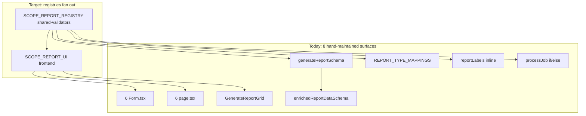
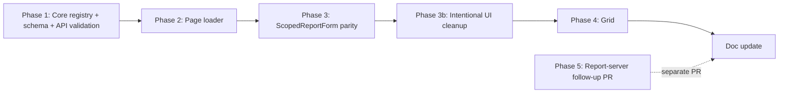

# Fix Finding 1: Scoped Report Type Duplication

## Problem Confirmed In Code

Six jurisdiction-scoped reports (`committeeRoster`, `signInSheet`, `designationWeightSummary`, `vacancyReport`, `changesReport`, `petitionOutcomesReport`) are duplicated across about 2,400 lines of near-identical frontend forms/pages plus parallel type lists and report-server branches.

Current parallel surfaces:

| # | Surface | File(s) | Issue |
| --- | --- | --- | --- |
| 1 | Form components | 6 `*Form.tsx` under `apps/frontend/src/app/*-reports/` | Shared scope/city/LD logic copy-pasted (~300 lines each) |
| 2 | Server pages | 6 `page.tsx` | Same auth, active term lookup, committee loading, and Leader jurisdiction filter |
| 3 | Report grid | `apps/frontend/src/components/reports/GenerateReportGrid.tsx` | Hard-coded card list for the same six |
| 4 | Request schema | `packages/shared-validators/src/schemas/report.ts` | Six near-identical Zod objects sharing `scopeFieldsSchema` |
| 5 | Enriched schema | same file | Second union re-spreading the same shapes |
| 6 | Type mapping | `packages/shared-validators/src/reportTypeMapping.ts` | `REPORT_TYPE_MAPPINGS` keys overlap scope types |
| 7 | API route labels | `apps/frontend/src/app/api/generateReport/route.ts` | Inline jurisdiction-error label map |
| 8 | Report server | `apps/report-server/src/index.ts` | Five standalone copied scope branches plus one shared `committeeRoster`/`ldCommittees` branch |

Evidence of drift already present: format controls mix select, radio pairs, and fixed PDF; name-error clearing is inconsistent; changes report uses different date formatting than the other five.



Reference matrix for behavior parity: `docs/SRS/REPORT_PARAMETER_MATRIX.md`.

## Pre-Implementation Must-Fix (from plan review)

These are cheap now and expensive later — resolve in Phase 1 before touching UI or report-server:

1. **Type derivation** — Do **not** use bare `Object.keys(registry)` for `ScopeReportType`; it returns `string[]` and collapses the literal union that powers `Extract<GenerateReportData, { type: ScopeReportType }>` and the existing `_ScopeExhaustive` check in `schemas/report.ts`. Instead:

```ts
export const SCOPE_REPORT_REGISTRY = { /* ... */ } as const;

export type ScopeReportType = keyof typeof SCOPE_REPORT_REGISTRY;

export const SCOPE_REPORT_TYPES = Object.keys(
  SCOPE_REPORT_REGISTRY,
) as ScopeReportType[] satisfies ScopeReportType[];
```

Keep the existing compile-time `_ScopeExhaustive` assertion in `schemas/report.ts` — it is the guard that catches a new scope schema added without a registry entry.

2. **Layer split** — Core registry in `shared-validators` holds **only** cross-package facts: `jurisdictionLabel`, `prismaReportType`, `filename`, `format`, `extraFields`. No `href`, `pageDescription`, `gridDescription`, `minPrivilege`, or form specs. Frontend registry extends with UI/routing concerns. Report-server must never import Next.js routes or page copy.

## Naming Footgun (call out in Phases 3 and 5)

- `committee-reports/` = legacy **`ldCommittees`** (out of scope for this refactor).
- `committee-roster-reports/` = scoped **`committeeRoster`** (in scope).
- Both map to Prisma `CommitteeReport` in `reportTypeMapping.ts` — easy to touch the wrong form or worker branch. When editing handlers or form specs, verify the `type` literal and route folder match before changing behavior.

## Non-Negotiable Invariants

This refactor touches reports, role-gated UI, and data scope. Preserve these throughout:

- Trust boundary: `POST /api/generateReport` stays protected by `withPrivilege(PrivilegeLevel.RequestAccess, ...)`.
- Server authority: API authorization, report creation, jurisdiction checks, and worker payloads use the actual session privilege (`session.user.privilegeLevel`), never `actingPermissions`.
- Client simulation: report cards/forms use `GlobalContext.actingPermissions` only for visibility and UI defaults.
- Data scope: Leader page data and API requests must be scoped to assigned jurisdictions; a Leader with no assignments or missing `user.id` must fail closed.
- Validation: `scope: "jurisdiction"` must require non-empty `cityTown` at API validation time (today enforced only in the worker for some types).
- Worker parity: report filenames, formats, PDF orientation, XLSX generators, and `committeeRoster` `includeFields`/`xlsxConfig` behavior remain unchanged in Phases 1–3 and in the report-server follow-up unless a Phase 3b item explicitly documents an intentional change.
- **Auth source of truth:** page access gates and API checks use actual session privilege and existing thresholds — never `SCOPE_REPORT_UI.minPrivilege` (grid display only).

## Target Architecture

### 1. Core Registry (shared-validators, cross-package)

Add `packages/shared-validators/src/scopeReportRegistry.ts` — **API + report-server facts only**:

```ts
export const SCOPE_REPORT_REGISTRY = {
  committeeRoster: {
    jurisdictionLabel: "committee rosters",
    prismaReportType: "CommitteeReport",
    filename: "committeeRoster",
    format: { kind: "select", options: ["pdf", "xlsx"], default: "xlsx" },
    extraFields: [],
  },
  signInSheet: {
    jurisdictionLabel: "sign-in sheets",
    prismaReportType: "SignInSheet",
    filename: "signInSheet",
    format: { kind: "fixed", value: "pdf" },
    extraFields: ["meetingDate"],
  },
  vacancyReport: {
    jurisdictionLabel: "vacancy reports",
    prismaReportType: "VacancyReport",
    filename: "vacancyReport",
    format: { kind: "select", options: ["pdf", "xlsx"], default: "xlsx" },
    extraFields: ["vacancyFilter"],
  },
  changesReport: {
    jurisdictionLabel: "changes reports",
    prismaReportType: "ChangesReport",
    filename: "changesReport",
    format: { kind: "select", options: ["pdf", "xlsx"], default: "xlsx" },
    extraFields: ["dateFrom", "dateTo"],
  },
  // designationWeightSummary, petitionOutcomesReport ...
} as const;

export type ScopeReportType = keyof typeof SCOPE_REPORT_REGISTRY;

export const SCOPE_REPORT_TYPES = Object.keys(
  SCOPE_REPORT_REGISTRY,
) as ScopeReportType[] satisfies ScopeReportType[];
```

Derive or validate from this registry:

- `ScopeReportType` and `SCOPE_REPORT_TYPES` as above (never bare `Object.keys` without the cast + `satisfies`).
- Keep existing `_ScopeExhaustive` compile-time check in `schemas/report.ts`.
- `getScopeReportJurisdictionLabel(type)`, replacing the inline map in `generateReport/route.ts`.
- Scope-report slice of `REPORT_TYPE_MAPPINGS`; non-scope types stay explicit.
- `isScopedReportData(data)` remains the API type guard.
- Exports through `packages/shared-validators/src/index.ts`.

**Do not** put `href`, titles, page/grid copy, `minPrivilege`, or form specs here.

### 2. Frontend UI Registry + Form Specs

Add `apps/frontend/src/components/reports/scopeReportUiRegistry.ts` — extends core registry with UI/routing:

```ts
export const SCOPE_REPORT_UI = {
  committeeRoster: {
    title: "Committee Roster",
    href: "/committee-roster-reports",
    pageDescription: "Generate current committee roster reports.",
    gridDescription: "Generate current committee roster reports (jurisdiction-scoped for leaders).",
    minPrivilege: PrivilegeLevel.Leader, // display/filter only — NOT page auth
    defaultNamePrefix: "Committee Roster",
  },
  // ...
} as const satisfies Record<ScopeReportType, ScopeReportUiDefinition>;
```

Form-specific differences live in `scopeReportFormSpecs.ts` (same frontend layer). Pages, grid, and `ScopedReportForm` import from here; report-server imports only the core registry.

### 3. Schema Tuple + Enriched Union Collapse

In `packages/shared-validators/src/schemas/report.ts`, introduce a typed tuple and build both unions from it:

```ts
const generateReportVariants = [
  designatedPetitionReportSchema,
  ldCommitteesReportSchema,
  committeeRosterReportSchema,
  voterListReportSchema,
  absenteeReportSchema,
  voterImportReportSchema,
  signInSheetReportSchema,
  designationWeightSummaryReportSchema,
  vacancyReportSchema,
  changesReportSchema,
  petitionOutcomesReportSchema,
] as const;

export const generateReportSchema = z.discriminatedUnion(
  "type",
  generateReportVariants,
);

const enrichVariant = <T extends z.AnyZodObject>(schema: T) =>
  schema.merge(enrichedFieldsSchema);

export const enrichedReportDataSchema = z.discriminatedUnion("type", [
  ...generateReportVariants.map(enrichVariant),
  enrichVariant(boeEligibilityFlaggingReportSchema),
]);
```

Prefer the explicit tuple over `generateReportSchema.options.map(...)` — avoids depending on Zod union internals and improves TypeScript inference.

Also harden `scopeFieldsSchema` with a refinement or per-variant helper so `scope: "jurisdiction"` requires non-empty `cityTown` at API validation time (Phase 1).

### 4. Frontend Page Loader

**Before Phase 2:** read `skills/auth-check-patterns/SKILL.md`. When thinning pages, verify each page's current gate threshold is preserved exactly (today: `hasPermissionFor(..., PrivilegeLevel.Leader)`). Do not assume `SCOPE_REPORT_UI.minPrivilege` matches the gate — copy the existing check verbatim into the loader or page shell.

Add `apps/frontend/src/lib/loadScopedReportPageData.ts`:

```ts
export async function loadScopedReportPageData(): Promise<ScopedReportPageData> {
  // auth(), actual privilege, active term, DB-side Leader filtering
}
```

Loader rules:

- Use actual session privilege from `auth()` for server-rendered access decisions.
- Deny or return empty committee lists for Leader sessions with missing `user.id`.
- Use `getUserJurisdictions()` + `buildJurisdictionWhere()` from `committeeValidation.ts` for DB-side filtering instead of loading all committees and filtering in memory.
- Preserve the current page gate: Leader or above can access scoped report pages.

Each of the six `page.tsx` files becomes a thin wrapper: call loader; render permission-denied shell if not allowed; render heading/copy from frontend UI registry; render `<ScopedReportForm type="..." committeeLists={...} userPrivilegeLevel={...} />`.

Optional: add `ScopedReportPageShell` for the repeated permission-denied card and page layout.

### 5. Shared Form Component + Specs (parity-first)

Add `apps/frontend/src/components/reports/ScopedReportForm.tsx` and `scopeReportFormSpecs.ts`.

`ScopedReportForm` owns shared behavior:

- State: `name`, `format`, `scope`, `cityTown`, `legDistrict`, report tracker state.
- Derived values: `cities`, `legDistricts`, Rochester LD rule.
- Handlers: city change, LD change, validation, submit, tracker success/failure.
- Common JSX: report name, scope selector, city/town dropdown, LD dropdown, format control, submit/link/spinner, `ReportStatusTracker`.

Specs own per-report differences:

| Report | Format | Extra fields | Payload extras |
| --- | --- | --- | --- |
| `committeeRoster` | pdf/xlsx | none | `includeFields`/`xlsxConfig` if present today |
| `signInSheet` | fixed pdf | optional meeting date | `meetingDate` |
| `designationWeightSummary` | pdf/xlsx | none | none |
| `vacancyReport` | pdf/xlsx | vacancy filter | `vacancyFilter` |
| `changesReport` | pdf/xlsx | date from/to | `dateFrom`, `dateTo`, extra validation |
| `petitionOutcomesReport` | pdf/xlsx | none | none |

**Phase 3 is parity-first:** preserve existing labels, default values, submit button text, payload shapes, validation messages, **and the exact format control widget** (select vs radio vs hidden/fixed) per report. Delete route-local form files only after migrated tests cover the shared form.

### 6. Explicit Form Cleanup (Phase 3b — required in main PR)

After Phase 3 parity is protected, apply **user-visible** cleanups in the same PR (sequential step — do not mix into Phase 3):

- **Format UI standardization** — collapsing select/radio/hidden into one control driven by `format.kind` is an intentional UI change (e.g. radio→select), not a no-op refactor. Requires focused tests **and manual QA** — this is the main regression surface.
- Clear name errors consistently when the name becomes non-empty.
- Standardize date/name default formatting across all reports (decide and document the chosen convention).

Do not bundle Phase 3b changes into Phase 3 parity work; land Phase 3 first with migrated tests, then Phase 3b before Phase 4.

### 7. GenerateReportGrid (Phase 4 — required in main PR)

Refactor `apps/frontend/src/components/reports/GenerateReportGrid.tsx`:

- Build the six scoped report cards from `SCOPE_REPORT_UI` (titles, descriptions, href, display minPrivilege).
- Keep non-scope entries (`voterList`, `designatedPetition`, advanced `ldCommittees`) as a small static list.
- Preserve client-only role simulation: filtering uses `actingPermissions`; `minPrivilege` on cards is **never** an authorization source.

Required in the main PR alongside Phases 1–3 so grid cards cannot drift from pages/forms.

### 8. Report-Server Handler Registry (Phase 5 — separate follow-up PR)

**Expectation:** scope branches are less uniform than they look. Fetch signatures differ (`vacancyFilter`, `dateFrom`/`dateTo`), PDF options differ (signInSheet = Letter/portrait, designationWeightSummary = Letter/landscape), and HTML generators take different args (`scopeDescription`, date range). The handler-map pattern absorbs this via closures, but real dedup is mainly the shared jurisdiction guard + filename + format-branch template (~4 lines × 5 branches ≈ **~20 lines**, not ~120). **Lowest dedup-to-risk ratio** — treat as a genuine follow-up PR, not a stretch goal bundled with the main dedup.

**Prerequisite:** add golden/snapshot tests capturing current HTML output (or representative strings) for at least one scope report per format **before** refactoring the render path. Unit tests on `assertJurisdictionScope` alone will not catch a dropped PDF option.

Add `apps/report-server/src/scopeReportHandlers/index.ts`:

```ts
type ScopeReportHandler<T extends ScopedEnrichedJob = ScopedEnrichedJob> = {
  fetch: (job: T) => Promise<unknown>;
  toPdf?: (rows: unknown, job: T) => string;
  toXlsx?: (rows: unknown, fileName: string, job: T) => Promise<void>;
  pdfOptions?: PDFOptions | ((job: T) => PDFOptions | undefined);
};

export const SCOPE_REPORT_HANDLERS = {
  // ...
} satisfies Record<ScopeReportType, ScopeReportHandler>;
```

Extract shared `processScopedReport(jobData)` template:

1. `assertJurisdictionScope(jobData)` for the shared `cityTown required when scope === jurisdiction` guard.
2. Generate filename with existing `generateReportFilename(...)`.
3. Fetch rows through the handler.
4. Branch on `format`: XLSX handler or HTML + `generatePDFAndUpload`.

**Important asymmetry:** `committeeRoster` is scoped but today shares the `ldCommittees` branch — uses `fetchCommitteeRosterData`, `mapCommitteesToReportShape`, `extractXLSXConfig`, `generateUnifiedXLSXAndUpload(..., "ldCommittees")`, and `generateCommitteeReportHTML`. Preserve those details unless intentionally changed.

Leave non-scope branches (`voterList`, `ldCommittees`, `absenteeReport`, `voterImport`, `designatedPetition`, `boeEligibilityFlagging`) as-is. Wire existing fetch/HTML/XLSX functions from `committeeMappingHelpers.ts` and `utils.ts` into handlers; do not rewrite them.

## Implementation Phases



| Phase | Scope | Ship in main PR? | Risk | Approx. line delta |
| --- | --- | --- | --- | --- |
| **1** | Core registry (typed keys), schema tuple, enriched collapse, jurisdiction labels, mapping alignment, API `cityTown` validation | Yes | Low-medium | −80 duplicated schema lines |
| **2** | Page loader with DB-side Leader filtering, thin six pages; read auth-check skill first | Yes | Low-medium | −300 page boilerplate |
| **3** | Shared form in **exact** parity mode, migrated tests, delete six form files | Yes | Medium | −1,500+ form lines |
| **3b** | Intentional UI changes (format control, error clearing, date formatting) + manual QA | Yes | Low-medium | behavior-only |
| **4** | `GenerateReportGrid` from UI registry | Yes | Low | small |
| **5** | Report-server handler map (after golden HTML snapshots) | **No — follow-up PR** | Medium | ~20 server lines |
| **Doc** | `BRANCH_ARCHITECTURE_REVIEW.md` update | After Phases 1–4 and 3b land | Low | — |

**Ship target:** Phases 1–4 and 3b in the main PR (order: 1 → 2 → 3 → 3b → 4). Phase 5 is a separate follow-up — the worker already keys off `type` strings and needs no change for the frontend dedup to land.

## Testing

| Area | Action |
| --- | --- |
| `packages/shared-validators/src/__tests__/schemas/report.test.ts` | Keep per-type parse tests; add enriched-schema derivation coverage; add `scope: "jurisdiction"` without `cityTown` rejection |
| New `scopeReportRegistry.test.ts` | Registry/schema/mapping/label alignment for every `ScopeReportType` |
| `packages/shared-validators/src/__tests__/reportTypeMapping.test.ts` | Confirm scope mapping entries are derived/aligned; non-scope entries remain intact |
| `apps/frontend/src/__tests__/api/generateReport.test.ts` | Preserve unauthenticated/insufficient privilege tests; add missing cityTown rejection; keep Leader countywide and cross-jurisdiction denial tests |
| New page-loader test | Leader sees only assigned committees; Leader with no jurisdictions gets empty list; Leader with missing `user.id` fails closed; Admin sees active-term committees |
| Shared form tests | Parametrized payload/validation tests for all six specs; `actingPermissions` controls UI visibility only |
| `GenerateReportGrid` tests | Cards derive scoped report metadata; `actingPermissions` hides reports below simulated role |
| report-server (Phase 5 only) | **Golden HTML snapshots before refactor**; then `assertJurisdictionScope`; handler-map exhaustiveness via `satisfies`; parity smoke for sign-in sheet PDF options and `committeeRoster` XLSX/PDF wiring |

Run after each phase:

```bash
pnpm run build:packages
pnpm --filter voter-file-tool test
pnpm --filter node-pdf-generation test
```

Before merging report/auth/role-gated UI changes, rerun the illegible-bug checklist from `AGENTS.md`:

- Trust boundary: every route is `withPrivilege`, `withBackendCheck`, or `withPublic`.
- Negative auth: tests cover unauthenticated, insufficient privilege, and cross-user/cross-scope access.
- Validation: request bodies use Zod/shared validators, not TypeScript casts.
- Data scope: list/file/report responses prove owner, jurisdiction, or privilege scope.

## Doc Update (required deliverable)

Update `docs/BRANCH_ARCHITECTURE_REVIEW.md` when work completes — mirror the Finding 2 resolution pattern:

1. Remediation log row: `Finding 1 — scoped report registry / dedup | Done (Phase N)` or `In progress`.
2. Finding 1 **Resolution** block documenting:
   - Files added (`scopeReportRegistry.ts`, frontend UI registry, `ScopedReportForm.tsx`, `loadScopedReportPageData.ts`, `scopeReportHandlers/`).
   - Files removed/thinned (six `*Form.tsx`, duplicated page scaffold, inline labels).
   - What is now derived vs still manual (non-scope reports in grid/mapping).
   - Intentional deferrals: Phase 5 report-server handler map shipped as separate follow-up PR.
   - Key decisions: narrow shared registry, frontend UI registry, schema tuple, API cityTown hardening, DB-side page filtering, parity-first form refactor, cleanup phase.
3. Test evidence for auth/data-scope invariants.
4. Optionally update subsystem map row K to note the registry as the new hub for scope reports.

## Out of Scope

- Non-scope reports (`voterList`, `absenteeReport`, `designatedPetition`, `ldCommittees`, `voterImport`) — different shapes, not part of Finding 1.
- Finding 5 designation-weight computation dedup (separate finding).
- Collapsing all 11 `generateReportSchema` variants into factories — only scope reports + enriched dedup here.
- `docs/SRS/REPORT_PARAMETER_MATRIX.md` update unless behavior changes (it should not).

## Success Criteria

- Adding a seventh scope report requires: one core registry entry, one UI registry entry, one zod schema variant, one form spec — not edits across 8 unrelated files (report-server handler added when Phase 5 lands or deferred).
- `SCOPE_REPORT_TYPES`, API labels, and grid cards cannot drift (derived from registries).
- `enrichedReportDataSchema` has a single enrichment path.
- Six form files and ~300 lines of page boilerplate removed.
- API rejects jurisdiction-scoped requests missing `cityTown` before report creation.
- `BRANCH_ARCHITECTURE_REVIEW.md` remediation log reflects completed work.

## Plan Review Notes

Incorporated from code review (terminal review, Jul 2026):

| # | Issue | Resolution |
| --- | --- | --- |
| 1 | `Object.keys(registry)` breaks `ScopeReportType` literal union | Type from `keyof typeof`; runtime array with `as ScopeReportType[] satisfies ScopeReportType[]`; keep `_ScopeExhaustive` |
| 2 | Registry bundles four concerns across layers | Core registry = API/worker facts only; frontend registry + form specs = UI/routing |
| 3 | Report-server dedup overstated (~120 lines) | Revised to ~20 lines; Phase 5 = separate follow-up PR, lowest dedup-to-risk |
| 4 | "No behavior change" vs format UI standardization | Phase 3 preserves exact widgets; Phase 3b = intentional UI change + manual QA |
| 5 | `committee-reports/` vs `committee-roster-reports/` footgun | Explicit callout section; both use `CommitteeReport` in mapping |
| — | Auth: grid `minPrivilege` ≠ page gate | Read auth-check skill before Phase 2; preserve existing gate verbatim |
| — | Golden snapshots before server refactor | Prerequisite for Phase 5 |
| — | `enrichVariant` via `.merge()` | Confirmed valid; keep `boeEligibilityFlagging` explicit |

**Ship target:** Phases 1–4 and 3b in main PR; Phase 5 deferred.
