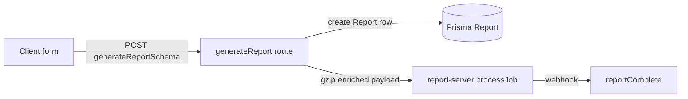

# Adding Reports

Read [skills/auth-check-patterns/SKILL.md](../auth-check-patterns/SKILL.md) before auth, jurisdiction scope, or role-gated UI work.

Behavior reference: [docs/SRS/REPORT_PARAMETER_MATRIX.md](../../docs/SRS/REPORT_PARAMETER_MATRIX.md).

## Pick the path first

| Report kind | Examples | Primary checklist |
| --- | --- | --- |
| **Jurisdiction-scoped** | `committeeRoster`, `signInSheet`, `vacancyReport`, … | [Scoped report checklist](#scoped-report-checklist) |
| **Other** | `voterList`, `absenteeReport`, `designatedPetition`, `ldCommittees`, `voterImport` | [Non-scoped report checklist](#non-scoped-report-checklist) |

**Footgun:** `committee-reports/` = legacy **`ldCommittees`**. `committee-roster-reports/` = scoped **`committeeRoster`**. Both map to Prisma `CommitteeReport` — verify the `type` literal and route folder before editing.

---

## Scoped report checklist

Use when the report has `scope: "jurisdiction" | "countywide"` and Leader jurisdiction enforcement.

```
- [ ] 1. Prisma ReportType enum + migration
- [ ] 2. Core registry (shared-validators)
- [ ] 3. Zod schema variant
- [ ] 4. Frontend UI registry + form messages
- [ ] 5. ScopedReportForm extras (if any)
- [ ] 6. Page route
- [ ] 7. Grid card (via UI registry order)
- [ ] 8. Report-server worker branch
- [ ] 9. Tests + illegible-bug checklist
```

### 1. Prisma `ReportType` + migration

Add the enum value in [apps/frontend/prisma/schema.prisma](../../apps/frontend/prisma/schema.prisma), then create a **new** migration (never edit old migration SQL):

```bash
pnpm --filter voter-file-tool db_migrate
pnpm run build:packages
```

### 2. Core registry (`shared-validators`)

Add one entry to [packages/shared-validators/src/scopeReportRegistry.ts](../../packages/shared-validators/src/scopeReportRegistry.ts):

```ts
myNewReport: {
  jurisdictionLabel: 'my new reports',   // API 403 message text
  prismaReportType: 'MyNewReport',       // must match Prisma enum
  filename: 'myNewReport',             // filename segment
  format: { kind: 'select', options: ['pdf', 'xlsx'], default: 'xlsx' },
  // or: format: { kind: 'fixed', value: 'pdf' },
  extraFields: [],                     // e.g. ['dateFrom', 'dateTo']
},
```

This auto-feeds:

- `ScopeReportType` / `SCOPE_REPORT_TYPES` (via `keyof typeof`)
- scope slice of [reportTypeMapping.ts](../../packages/shared-validators/src/reportTypeMapping.ts)
- `getScopeReportJurisdictionLabel()`

**Do not** put `href`, page copy, or `minPrivilege` here — report-server imports this package.

Add/extend [scopeReportRegistry.test.ts](../../packages/shared-validators/src/__tests__/scopeReportRegistry.test.ts) so registry, mapping, and labels stay aligned.

### 3. Zod schema variant

In [packages/shared-validators/src/schemas/report.ts](../../packages/shared-validators/src/schemas/report.ts):

1. Add `myNewReportReportSchema` using `...scopeFieldsBase.shape` when scoped.
2. Append it to the `generateReportVariants` tuple (source of `generateReportSchema` and `enrichedReportDataSchema`).

Jurisdiction rule: `scope: "jurisdiction"` requires non-empty `cityTown` — enforced by the union-level `superRefine` on `generateReportSchema` / `enrichedReportDataSchema`. Per-field extras (date range, filters) belong on the variant schema.

Add parse/reject tests in [schemas/report.test.ts](../../packages/shared-validators/src/__tests__/schemas/report.test.ts).

### 4. Frontend UI registry + messages

**UI metadata** — [apps/frontend/src/components/reports/scopeReportUiRegistry.ts](../../apps/frontend/src/components/reports/scopeReportUiRegistry.ts):

```ts
myNewReport: {
  title: 'My New Report',              // page H1
  gridTitle: 'My New Report',          // reports grid card
  href: '/my-new-reports',
  pageDescription: '...',
  gridDescription: '...',
  minPrivilege: PrivilegeLevel.Leader, // display/filter ONLY — not page auth
  defaultNamePrefix: 'My New Report',
},
```

Append the key to `SCOPE_REPORT_UI_ORDER`.

**Copy/messaging** — [scopeReportFormSpecs.ts](../../apps/frontend/src/components/reports/scopeReportFormSpecs.ts): toast strings, loading message, submit label.

Page auth gate stays `hasPermissionFor(..., PrivilegeLevel.Leader)` in [loadScopedReportPageData.ts](../../apps/frontend/src/lib/loadScopedReportPageData.ts) — do not derive page access from `minPrivilege`.

### 5. `ScopedReportForm` extras

[ScopedReportForm.tsx](../../apps/frontend/src/components/reports/ScopedReportForm.tsx) owns shared scope/city/LD/format/submit UI. For report-specific fields:

- Add state + JSX block guarded by `type === "myNewReport"`
- Extend `validate()` for extra required fields
- Extend `buildPayload()` switch with typed `ScopedReportData` branch

Format control: driven by `SCOPE_REPORT_REGISTRY[type].format` (select or hidden fixed PDF).

### 6. Page route

Add [apps/frontend/src/app/my-new-reports/page.tsx](../../apps/frontend/src/app):

```tsx
import { loadScopedReportPageData } from "~/lib/loadScopedReportPageData";
import { ScopedReportPageShell } from "~/components/reports/ScopedReportPageShell";

const MyNewReportsPage = async () => {
  const pageData = await loadScopedReportPageData();
  return <ScopedReportPageShell type="myNewReport" pageData={pageData} />;
};

export default MyNewReportsPage;
```

No custom jurisdiction filtering in the page — loader handles it.

### 7. Grid card

Scoped cards are derived from `SCOPE_REPORT_UI` + `SCOPE_REPORT_UI_ORDER` in [GenerateReportGrid.tsx](../../apps/frontend/src/components/reports/GenerateReportGrid.tsx). No manual card entry needed if UI registry is updated.

### 8. Report-server worker

In [apps/report-server/src/index.ts](../../apps/report-server/src/index.ts) `processJob`:

1. Add `fetch*Data` + row type in [committeeMappingHelpers.ts](../../apps/report-server/src/committeeMappingHelpers.ts) (or appropriate module).
2. Add HTML/XLSX generators in [utils.ts](../../apps/report-server/src/utils.ts) or a dedicated module.
3. Wire a new `else if (jobData.type === 'myNewReport')` branch (or register in `scopeReportHandlers/` when that follow-up lands).

Preserve existing asymmetries (e.g. `committeeRoster` shares `ldCommittees` XLSX wiring).

**Before refactoring render paths:** add golden/snapshot tests on HTML output for at least one format.

Worker-only types (e.g. `boeEligibilityFlagging`) go in `enrichedReportDataSchema` only — not `generateReportSchema`.

### 9. Tests

| Layer | What to add |
| --- | --- |
| `shared-validators` | Registry alignment; schema parse/reject; jurisdiction without `cityTown` |
| `POST /api/generateReport` | 400 missing `cityTown`; Leader cross-jurisdiction 403; happy path |
| Page loader | Leader empty jurisdictions fail-closed; DB-side filter ([loadScopedReportPageData.test.ts](../../apps/frontend/src/__tests__/lib/loadScopedReportPageData.test.ts)) |
| Form | Payload/validation via `ScopedReportForm` parametrized test |
| report-server | Fetch/transform unit tests; HTML snapshot before large refactors |

Run:

```bash
pnpm run build:packages
pnpm --filter voter-file-tool test
pnpm --filter node-pdf-generation test
```

Before merge, run the illegible-bug checklist in [AGENTS.md](../../AGENTS.md).

---

## Non-scoped report checklist

Use when the report does **not** use jurisdiction scope (search-based, file upload, payload form, admin-only legacy, etc.).

```
- [ ] 1. Prisma ReportType enum + migration (if new DB type)
- [ ] 2. Zod variant in generateReportVariants
- [ ] 3. REPORT_TYPE_MAPPINGS entry in reportTypeMapping.ts (non-scope section)
- [ ] 4. Dedicated form/page (no ScopedReportForm)
- [ ] 5. GenerateReportGrid entry in NON_SCOPE_REPORT_TYPES (or admin-only block)
- [ ] 6. report-server processJob branch
- [ ] 7. Tests
```

Key files same as scoped for schema/mapping/API, but **no** `scopeReportRegistry` / `SCOPE_REPORT_UI` entry.

API route: [apps/frontend/src/app/api/generateReport/route.ts](../../apps/frontend/src/app/api/generateReport/route.ts) — wrap with `withPrivilege`, validate via `generateReportSchema`, add any type-specific auth guards (see `ldCommittees` admin-only pattern).

---

## API flow (all report types)



- Request body: `generateReportSchema`
- Worker payload: `enrichedReportDataSchema` (+ `reportAuthor`, `jobId`)
- Filename: `generateReportFilename()` + `getFilenameReportType()`

---

## Auth invariants (scoped reports)

| Concern | Rule |
| --- | --- |
| API / page loader | Actual session privilege from `auth()` |
| Form scope defaults / grid visibility | `GlobalContext.actingPermissions` |
| Leader data scope | `loadScopedReportPageData` + `validateReportJurisdictionAccess` |
| Grid `minPrivilege` | Display only — never authorization source |

Leaders with no jurisdictions or missing `user.id` → fail closed (empty committee list).

---

## Compile-time guards

After adding a scoped schema with `scopeFieldsBase`, TypeScript `_ScopeExhaustive` in [report.ts](../../packages/shared-validators/src/schemas/report.ts) errors if the new type is missing from `SCOPE_REPORT_REGISTRY` / `SCOPE_REPORT_TYPES`.

When adding a registry entry, always add the matching Zod variant in the same PR.
